# CiviLabs LMS - Architecture Flow Diagrams

> Comprehensive Mermaid flowcharts documenting all application flows, data paths, and system interactions.
>
> **See also:** [ARCHITECTURE_DEFINITIONS.md](./ARCHITECTURE_DEFINITIONS.md) for detailed descriptions of each section.

---

## Table of Contents

1. [High-Level System Architecture](#1-high-level-system-architecture)
2. [Authentication Flows](#2-authentication-flows)
3. [User Journey Flows](#3-user-journey-flows)
4. [Course Management Flows](#4-course-management-flows)
5. [Learning & Progress Flows](#5-learning--progress-flows)
6. [Quiz & Assessment Flows](#6-quiz--assessment-flows)
7. [Certificate Flows](#7-certificate-flows)
8. [Community Flows (Forums & Chat)](#8-community-flows-forums--chat)
9. [Admin Flows](#9-admin-flows)
10. [API Sequence Diagrams](#10-api-sequence-diagrams)
11. [Data Flow Diagrams](#11-data-flow-diagrams)
12. [Role-Based Access Control](#12-role-based-access-control)
13. [State Diagrams](#13-state-diagrams)
14. [3D Scene Flows](#14-3d-scene-flows)
15. [Notification System](#15-notification-system)
16. [Media & Upload Flows](#16-media--upload-flows)
17. [MFA & Security Flows](#17-mfa--security-flows)
18. [Course Approval Workflow](#18-course-approval-workflow)
19. [Email Campaign Flows](#19-email-campaign-flows)
20. [Data Retention & GDPR Flows](#20-data-retention--gdpr-flows)
21. [Calendar & Scheduling Flows](#21-calendar--scheduling-flows)
22. [Groups & Collaboration Flows](#22-groups--collaboration-flows)
23. [Advanced Analytics Flows](#23-advanced-analytics-flows)
24. [Webhooks & API Key Flows](#24-webhooks--api-key-flows)

---

## 1. High-Level System Architecture

### 1.1 Overall System Overview

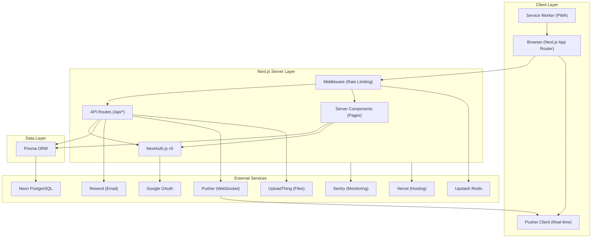
```mermaid
graph TB
    subgraph Client["Client Layer"]
        Browser["Browser (Next.js App Router)"]
        SW["Service Worker (PWA)"]
        Pusher_Client["Pusher Client (Real-time)"]
    end

    subgraph NextJS["Next.js Server Layer"]
        Pages["Server Components (Pages)"]
        API["API Routes (/api/*)"]
        Middleware["Middleware (Rate Limiting)"]
        Auth["NextAuth.js v5"]
    end

    subgraph Services["External Services"]
        Neon["Neon PostgreSQL"]
        Upstash["Upstash Redis"]
        Google["Google OAuth"]
        Resend["Resend (Email)"]
        Pusher_Server["Pusher (WebSocket)"]
        UploadThing["UploadThing (Files)"]
        Sentry["Sentry (Monitoring)"]
        Vercel["Vercel (Hosting)"]
    end

    subgraph Data["Data Layer"]
        Prisma["Prisma ORM"]
    end

    Browser --> Middleware
    Middleware --> API
    Middleware --> Pages
    Browser --> Pusher_Client
    SW --> Browser

    API --> Auth
    API --> Prisma
    Pages --> Prisma
    Pages --> Auth

    Prisma --> Neon
    Middleware --> Upstash
    Auth --> Google
    API --> Resend
    API --> Pusher_Server
    API --> UploadThing
    Pusher_Server --> Pusher_Client
    NextJS --> Sentry
    NextJS --> Vercel
```

### 1.2 Request Lifecycle

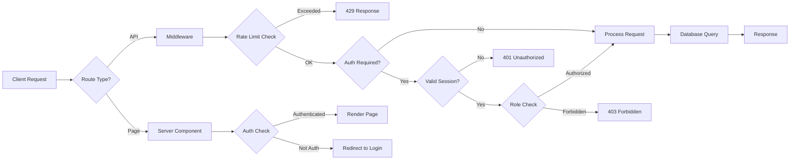
```mermaid
flowchart LR
    A[Client Request] --> B{Route Type?}
    B -->|Page| C[Server Component]
    B -->|API| D[Middleware]

    D --> E{Rate Limit Check}
    E -->|Exceeded| F[429 Response]
    E -->|OK| G{Auth Required?}

    G -->|Yes| H{Valid Session?}
    G -->|No| I[Process Request]

    H -->|Yes| J{Role Check}
    H -->|No| K[401 Unauthorized]

    J -->|Authorized| I
    J -->|Forbidden| L[403 Forbidden]

    I --> M[Database Query]
    M --> N[Response]

    C --> O{Auth Check}
    O -->|Authenticated| P[Render Page]
    O -->|Not Auth| Q[Redirect to Login]
```

---

## 2. Authentication Flows

### 2.1 Credentials Login Flow

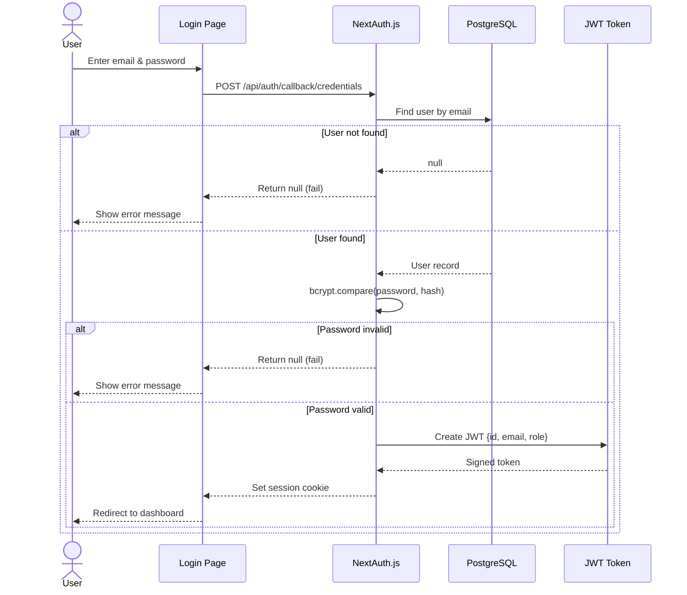
```mermaid
sequenceDiagram
    actor User
    participant LoginPage as Login Page
    participant NextAuth as NextAuth.js
    participant DB as PostgreSQL
    participant JWT as JWT Token

    User->>LoginPage: Enter email & password
    LoginPage->>NextAuth: POST /api/auth/callback/credentials
    NextAuth->>DB: Find user by email

    alt User not found
        DB-->>NextAuth: null
        NextAuth-->>LoginPage: Return null (fail)
        LoginPage-->>User: Show error message
    else User found
        DB-->>NextAuth: User record
        NextAuth->>NextAuth: bcrypt.compare(password, hash)

        alt Password invalid
            NextAuth-->>LoginPage: Return null (fail)
            LoginPage-->>User: Show error message
        else Password valid
            NextAuth->>JWT: Create JWT {id, email, role}
            JWT-->>NextAuth: Signed token
            NextAuth-->>LoginPage: Set session cookie
            LoginPage-->>User: Redirect to dashboard
        end
    end
```

### 2.2 Google OAuth Login Flow

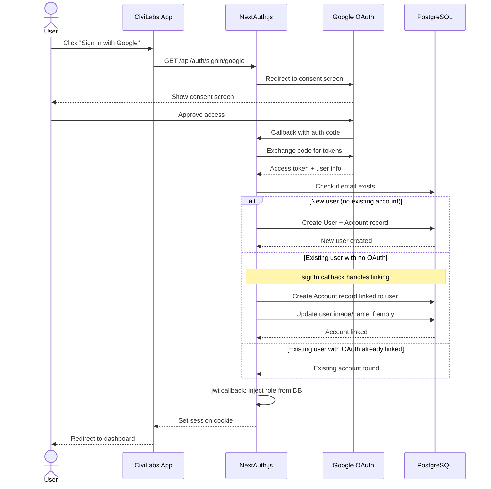
```mermaid
sequenceDiagram
    actor User
    participant App as CiviLabs App
    participant NextAuth as NextAuth.js
    participant Google as Google OAuth
    participant DB as PostgreSQL

    User->>App: Click "Sign in with Google"
    App->>NextAuth: GET /api/auth/signin/google
    NextAuth->>Google: Redirect to consent screen
    Google-->>User: Show consent screen
    User->>Google: Approve access
    Google->>NextAuth: Callback with auth code
    NextAuth->>Google: Exchange code for tokens
    Google-->>NextAuth: Access token + user info

    NextAuth->>DB: Check if email exists

    alt New user (no existing account)
        NextAuth->>DB: Create User + Account record
        DB-->>NextAuth: New user created
    else Existing user with no OAuth
        Note over NextAuth,DB: signIn callback handles linking
        NextAuth->>DB: Create Account record linked to user
        NextAuth->>DB: Update user image/name if empty
        DB-->>NextAuth: Account linked
    else Existing user with OAuth already linked
        DB-->>NextAuth: Existing account found
    end

    NextAuth->>NextAuth: jwt callback: inject role from DB
    NextAuth-->>App: Set session cookie
    App-->>User: Redirect to dashboard
```

### 2.3 Registration Flow

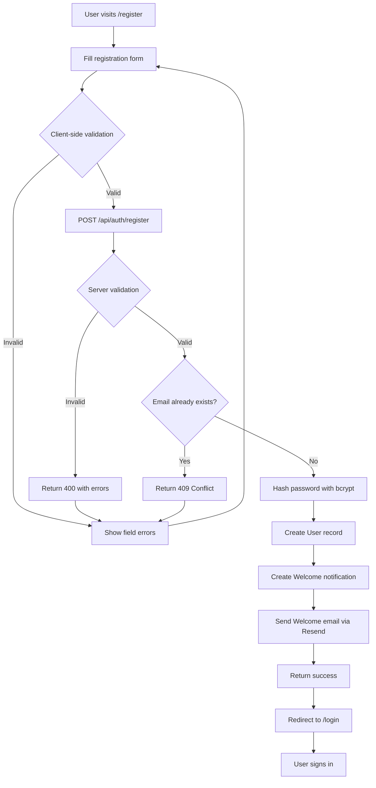
```mermaid
flowchart TD
    A[User visits /register] --> B[Fill registration form]
    B --> C{Client-side validation}
    C -->|Invalid| D[Show field errors]
    D --> B
    C -->|Valid| E[POST /api/auth/register]

    E --> F{Server validation}
    F -->|Invalid| G[Return 400 with errors]
    G --> D

    F -->|Valid| H{Email already exists?}
    H -->|Yes| I[Return 409 Conflict]
    I --> D

    H -->|No| J[Hash password with bcrypt]
    J --> K[Create User record]
    K --> L[Create Welcome notification]
    L --> M[Send Welcome email via Resend]
    M --> N[Return success]
    N --> O[Redirect to /login]
    O --> P[User signs in]
```

### 2.4 Session Management State Diagram

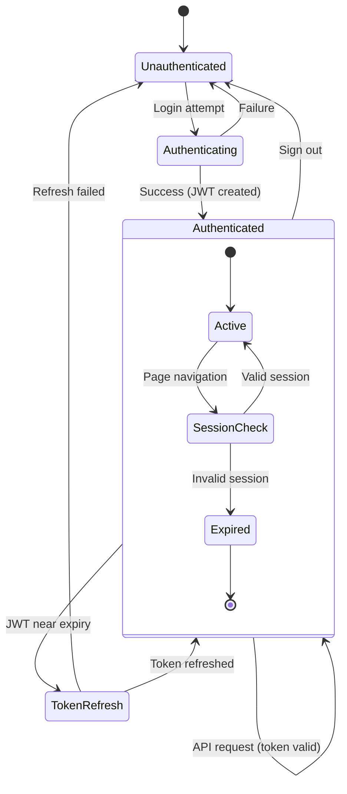
```mermaid
stateDiagram-v2
    [*] --> Unauthenticated

    Unauthenticated --> Authenticating : Login attempt
    Authenticating --> Authenticated : Success (JWT created)
    Authenticating --> Unauthenticated : Failure

    Authenticated --> TokenRefresh : JWT near expiry
    TokenRefresh --> Authenticated : Token refreshed
    TokenRefresh --> Unauthenticated : Refresh failed

    Authenticated --> Unauthenticated : Sign out
    Authenticated --> Authenticated : API request (token valid)

    state Authenticated {
        [*] --> Active
        Active --> SessionCheck : Page navigation
        SessionCheck --> Active : Valid session
        SessionCheck --> Expired : Invalid session
        Expired --> [*]
    }
```

---

## 3. User Journey Flows

### 3.1 Student Complete Journey

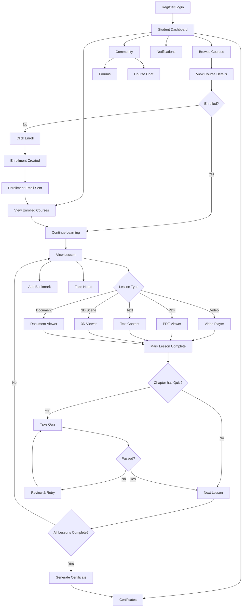
```mermaid
flowchart TD
    A[Register/Login] --> B[Student Dashboard]

    B --> C[Browse Courses]
    B --> D[View Enrolled Courses]
    B --> E[Community]
    B --> F[Certificates]
    B --> G[Notifications]

    C --> H[View Course Details]
    H --> I{Enrolled?}
    I -->|No| J[Click Enroll]
    J --> K[Enrollment Created]
    K --> L[Enrollment Email Sent]
    L --> D
    I -->|Yes| M[Continue Learning]

    D --> M
    M --> N[View Lesson]
    N --> O{Lesson Type}
    O -->|Video| P[Video Player]
    O -->|PDF| Q[PDF Viewer]
    O -->|Text| R[Text Content]
    O -->|3D Scene| S[3D Viewer]
    O -->|Document| T[Document Viewer]

    P & Q & R & S & T --> U[Mark Lesson Complete]
    U --> V{Chapter has Quiz?}
    V -->|Yes| W[Take Quiz]
    V -->|No| X[Next Lesson]

    W --> Y{Passed?}
    Y -->|No| Z[Review & Retry]
    Z --> W
    Y -->|Yes| X

    X --> AA{All Lessons Complete?}
    AA -->|No| N
    AA -->|Yes| AB[Generate Certificate]
    AB --> F

    E --> AC[Forums]
    E --> AD[Course Chat]

    N --> AE[Add Bookmark]
    N --> AF[Take Notes]
```

### 3.2 Instructor Complete Journey

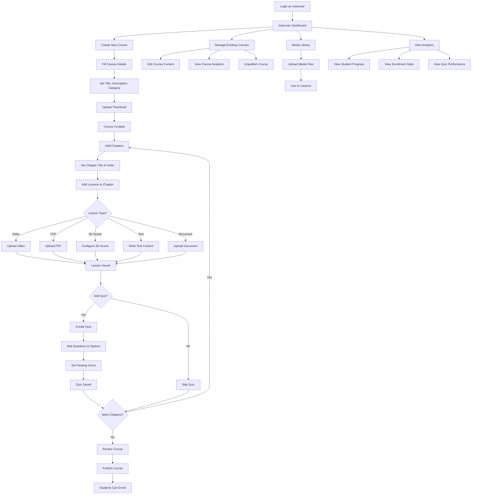
```mermaid
flowchart TD
    A[Login as Instructor] --> B[Instructor Dashboard]

    B --> C[Create New Course]
    B --> D[Manage Existing Courses]
    B --> E[Media Library]
    B --> F[View Analytics]

    C --> G[Fill Course Details]
    G --> H[Set Title, Description, Category]
    H --> I[Upload Thumbnail]
    I --> J[Course Created]

    J --> K[Add Chapters]
    K --> L[Set Chapter Title & Order]
    L --> M[Add Lessons to Chapter]

    M --> N{Lesson Type?}
    N -->|Video| O[Upload Video]
    N -->|PDF| P[Upload PDF]
    N -->|3D Scene| Q[Configure 3D Scene]
    N -->|Text| R[Write Text Content]
    N -->|Document| S[Upload Document]

    O & P & Q & R & S --> T[Lesson Saved]

    T --> U{Add Quiz?}
    U -->|Yes| V[Create Quiz]
    V --> W[Add Questions & Options]
    W --> X[Set Passing Score]
    X --> Y[Quiz Saved]
    U -->|No| Y2[Skip Quiz]

    Y & Y2 --> Z{More Chapters?}
    Z -->|Yes| K
    Z -->|No| AA[Review Course]

    AA --> AB[Publish Course]
    AB --> AC[Students Can Enroll]

    D --> AD[Edit Course Content]
    D --> AE[View Course Analytics]
    D --> AF[Unpublish Course]

    E --> AG[Upload Media Files]
    AG --> AH[Use in Lessons]

    F --> AI[View Student Progress]
    F --> AJ[View Enrollment Stats]
    F --> AK[View Quiz Performance]
```

### 3.3 Admin Complete Journey

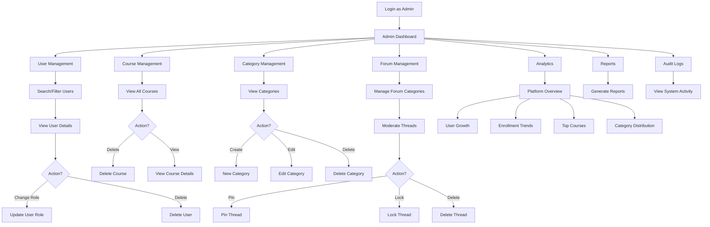
```mermaid
flowchart TD
    A[Login as Admin] --> B[Admin Dashboard]

    B --> C[User Management]
    B --> D[Course Management]
    B --> E[Category Management]
    B --> F[Forum Management]
    B --> G[Analytics]
    B --> H[Reports]
    B --> I[Audit Logs]

    C --> J[Search/Filter Users]
    J --> K[View User Details]
    K --> L{Action?}
    L -->|Change Role| M[Update User Role]
    L -->|Delete| N[Delete User]

    D --> O[View All Courses]
    O --> P{Action?}
    P -->|Delete| Q[Delete Course]
    P -->|View| R[View Course Details]

    E --> S[View Categories]
    S --> T{Action?}
    T -->|Create| U[New Category]
    T -->|Edit| V[Edit Category]
    T -->|Delete| W[Delete Category]

    F --> X[Manage Forum Categories]
    X --> Y[Moderate Threads]
    Y --> Z{Action?}
    Z -->|Pin| AA[Pin Thread]
    Z -->|Lock| AB[Lock Thread]
    Z -->|Delete| AC[Delete Thread]

    G --> AD[Platform Overview]
    AD --> AE[User Growth]
    AD --> AF[Enrollment Trends]
    AD --> AG[Top Courses]
    AD --> AH[Category Distribution]

    H --> AI[Generate Reports]
    I --> AJ[View System Activity]
```

---

## 4. Course Management Flows

### 4.1 Course Creation & Publishing

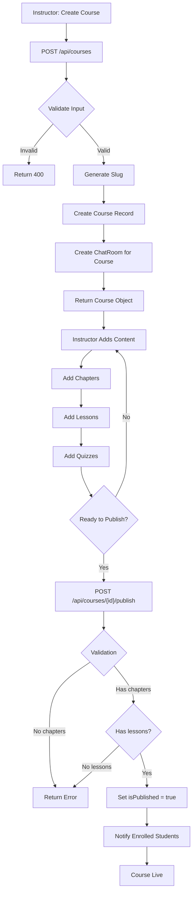
```mermaid
flowchart TD
    A[Instructor: Create Course] --> B[POST /api/courses]

    B --> C{Validate Input}
    C -->|Invalid| D[Return 400]
    C -->|Valid| E[Generate Slug]

    E --> F[Create Course Record]
    F --> G[Create ChatRoom for Course]
    G --> H[Return Course Object]

    H --> I[Instructor Adds Content]
    I --> J[Add Chapters]
    J --> K[Add Lessons]
    K --> L[Add Quizzes]

    L --> M{Ready to Publish?}
    M -->|No| I
    M -->|Yes| N["POST /api/courses/{id}/publish"]

    N --> O{Validation}
    O -->|Has chapters| P{Has lessons?}
    O -->|No chapters| Q[Return Error]
    P -->|Yes| R[Set isPublished = true]
    P -->|No lessons| Q

    R --> S[Notify Enrolled Students]
    S --> T[Course Live]
```

### 4.2 Course Content Structure

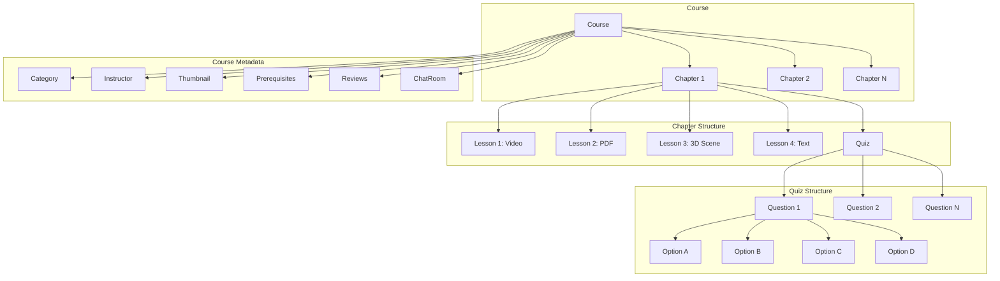
```mermaid
graph TD
    subgraph Course
        A[Course]
        A --> B1[Chapter 1]
        A --> B2[Chapter 2]
        A --> B3[Chapter N]
    end

    subgraph "Chapter Structure"
        B1 --> C1[Lesson 1: Video]
        B1 --> C2[Lesson 2: PDF]
        B1 --> C3[Lesson 3: 3D Scene]
        B1 --> C4[Lesson 4: Text]
        B1 --> D1[Quiz]
    end

    subgraph "Quiz Structure"
        D1 --> E1[Question 1]
        D1 --> E2[Question 2]
        D1 --> E3[Question N]
        E1 --> F1[Option A]
        E1 --> F2[Option B]
        E1 --> F3[Option C]
        E1 --> F4[Option D]
    end

    subgraph "Course Metadata"
        A --> G1[Category]
        A --> G2[Instructor]
        A --> G3[Thumbnail]
        A --> G4[Prerequisites]
        A --> G5[Reviews]
        A --> G6[ChatRoom]
    end
```

### 4.3 Course State Diagram

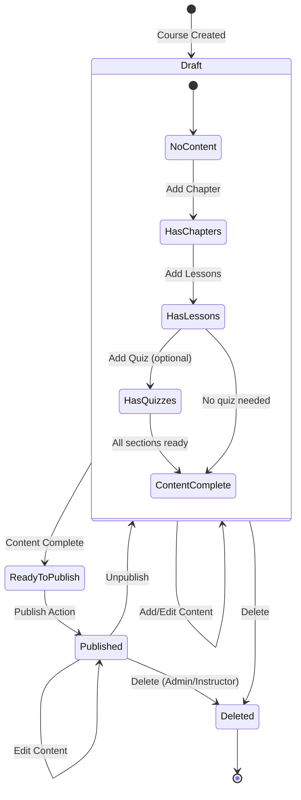
```mermaid
stateDiagram-v2
    [*] --> Draft : Course Created

    Draft --> Draft : Add/Edit Content
    Draft --> ReadyToPublish : Content Complete
    ReadyToPublish --> Published : Publish Action
    Published --> Draft : Unpublish
    Published --> Published : Edit Content

    state Draft {
        [*] --> NoContent
        NoContent --> HasChapters : Add Chapter
        HasChapters --> HasLessons : Add Lessons
        HasLessons --> HasQuizzes : Add Quiz (optional)
        HasQuizzes --> ContentComplete : All sections ready
        HasLessons --> ContentComplete : No quiz needed
    }

    Published --> Deleted : Delete (Admin/Instructor)
    Draft --> Deleted : Delete
    Deleted --> [*]
```

---

## 5. Learning & Progress Flows

### 5.1 Lesson Viewing & Progress Tracking

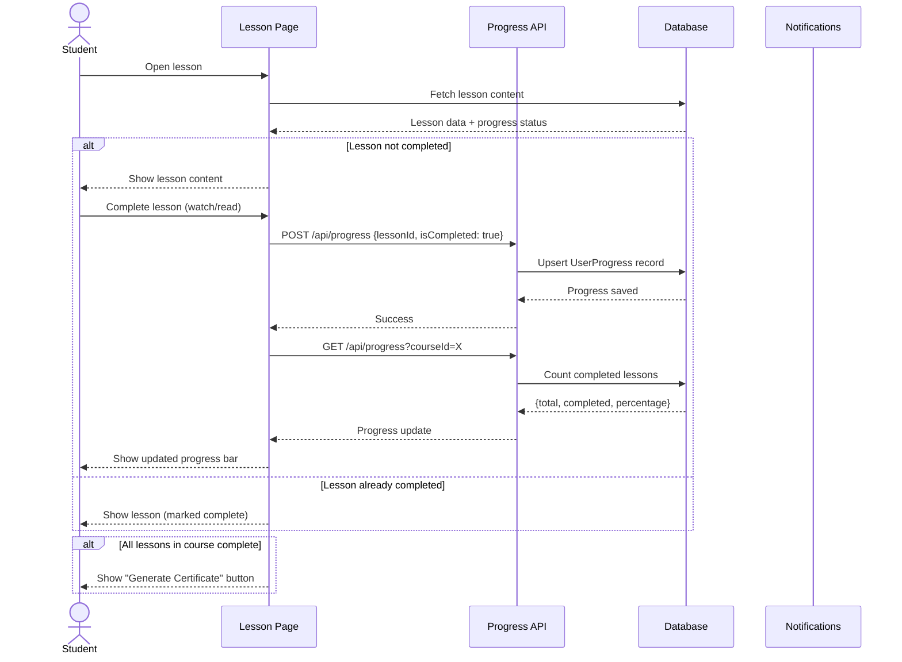
```mermaid
sequenceDiagram
    actor Student
    participant Page as Lesson Page
    participant API as Progress API
    participant DB as Database
    participant Notify as Notifications

    Student->>Page: Open lesson
    Page->>DB: Fetch lesson content
    DB-->>Page: Lesson data + progress status

    alt Lesson not completed
        Page-->>Student: Show lesson content
        Student->>Page: Complete lesson (watch/read)
        Page->>API: POST /api/progress {lessonId, isCompleted: true}
        API->>DB: Upsert UserProgress record
        DB-->>API: Progress saved
        API-->>Page: Success

        Page->>API: GET /api/progress?courseId=X
        API->>DB: Count completed lessons
        DB-->>API: {total, completed, percentage}
        API-->>Page: Progress update
        Page-->>Student: Show updated progress bar
    else Lesson already completed
        Page-->>Student: Show lesson (marked complete)
    end

    alt All lessons in course complete
        Page-->>Student: Show "Generate Certificate" button
    end
```

### 5.2 Course Progress State

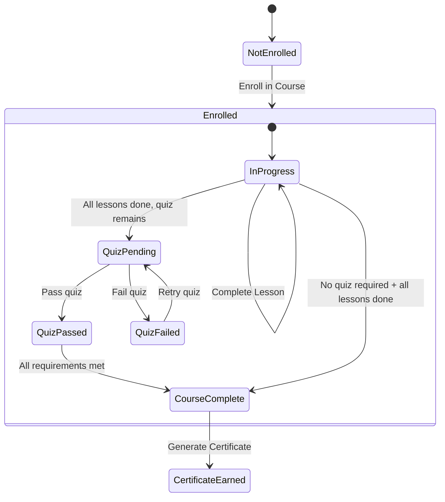
```mermaid
stateDiagram-v2
    [*] --> NotEnrolled

    NotEnrolled --> Enrolled : Enroll in Course

    state Enrolled {
        [*] --> InProgress
        InProgress --> InProgress : Complete Lesson
        InProgress --> QuizPending : All lessons done, quiz remains
        QuizPending --> QuizPassed : Pass quiz
        QuizPending --> QuizFailed : Fail quiz
        QuizFailed --> QuizPending : Retry quiz
        QuizPassed --> CourseComplete : All requirements met
        InProgress --> CourseComplete : No quiz required + all lessons done
    }

    CourseComplete --> CertificateEarned : Generate Certificate
```

### 5.3 Enrollment Flow

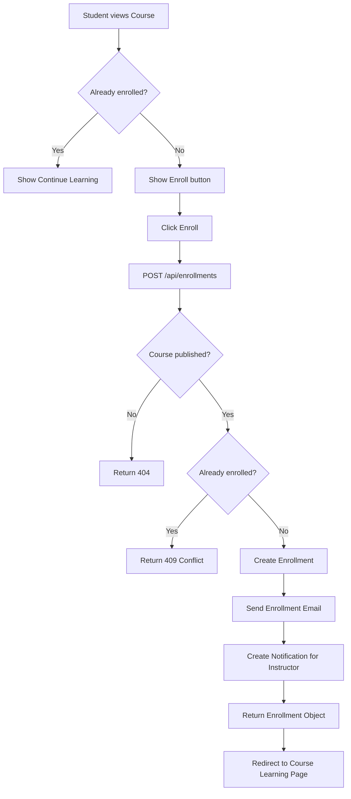
```mermaid
flowchart TD
    A[Student views Course] --> B{Already enrolled?}
    B -->|Yes| C["Show Continue Learning"]
    B -->|No| D["Show Enroll button"]

    D --> E[Click Enroll]
    E --> F["POST /api/enrollments"]

    F --> G{Course published?}
    G -->|No| H[Return 404]
    G -->|Yes| I{Already enrolled?}
    I -->|Yes| J[Return 409 Conflict]
    I -->|No| K[Create Enrollment]

    K --> L[Send Enrollment Email]
    L --> M[Create Notification for Instructor]
    M --> N[Return Enrollment Object]
    N --> O[Redirect to Course Learning Page]
```

---

## 6. Quiz & Assessment Flows

### 6.1 Quiz Attempt Flow

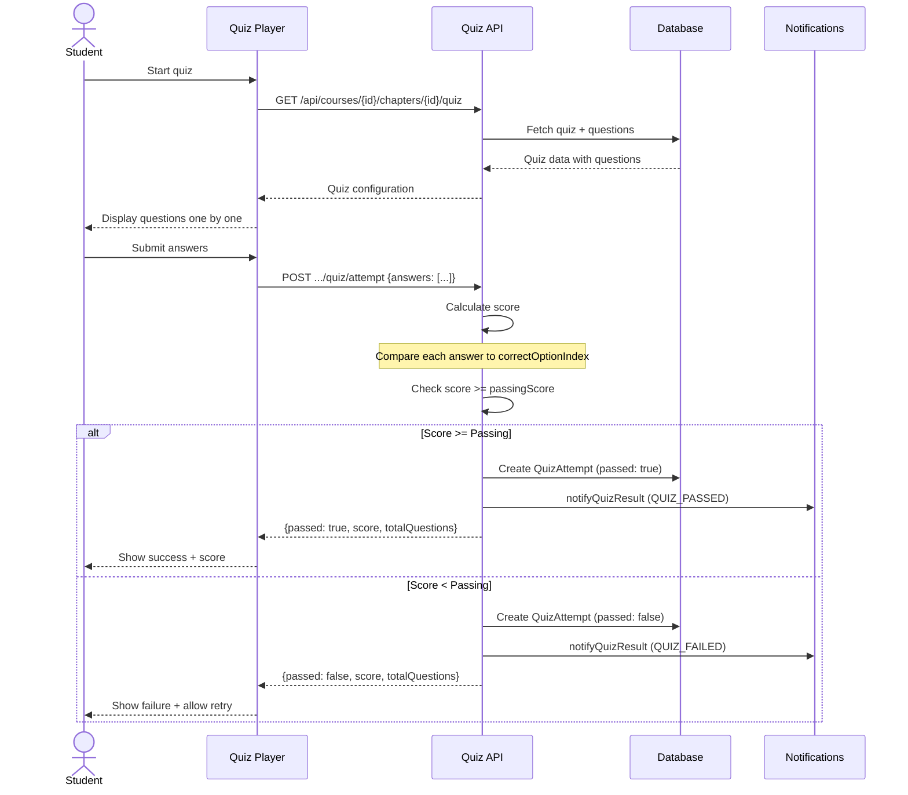
```mermaid
sequenceDiagram
    actor Student
    participant QuizUI as Quiz Player
    participant API as Quiz API
    participant DB as Database
    participant Notify as Notifications

    Student->>QuizUI: Start quiz
    QuizUI->>API: GET /api/courses/{id}/chapters/{id}/quiz
    API->>DB: Fetch quiz + questions
    DB-->>API: Quiz data with questions
    API-->>QuizUI: Quiz configuration

    QuizUI-->>Student: Display questions one by one

    Student->>QuizUI: Submit answers
    QuizUI->>API: POST .../quiz/attempt {answers: [...]}

    API->>API: Calculate score
    Note over API: Compare each answer to correctOptionIndex
    API->>API: Check score >= passingScore

    alt Score >= Passing
        API->>DB: Create QuizAttempt (passed: true)
        API->>Notify: notifyQuizResult (QUIZ_PASSED)
        API-->>QuizUI: {passed: true, score, totalQuestions}
        QuizUI-->>Student: Show success + score
    else Score < Passing
        API->>DB: Create QuizAttempt (passed: false)
        API->>Notify: notifyQuizResult (QUIZ_FAILED)
        API-->>QuizUI: {passed: false, score, totalQuestions}
        QuizUI-->>Student: Show failure + allow retry
    end
```

### 6.2 Quiz Builder Flow (Instructor)

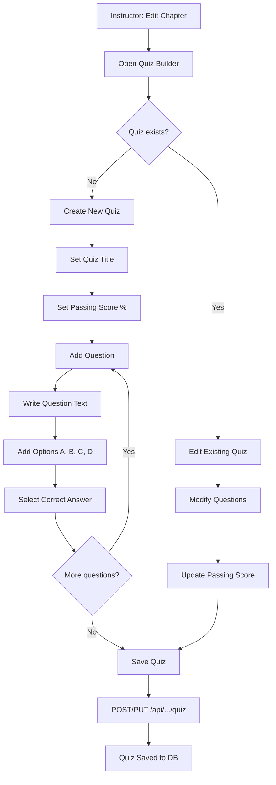
```mermaid
flowchart TD
    A[Instructor: Edit Chapter] --> B[Open Quiz Builder]
    B --> C{Quiz exists?}
    C -->|No| D[Create New Quiz]
    C -->|Yes| E[Edit Existing Quiz]

    D --> F[Set Quiz Title]
    F --> G[Set Passing Score %]
    G --> H[Add Question]

    H --> I[Write Question Text]
    I --> J[Add Options A, B, C, D]
    J --> K[Select Correct Answer]
    K --> L{More questions?}
    L -->|Yes| H
    L -->|No| M[Save Quiz]

    E --> N[Modify Questions]
    N --> O[Update Passing Score]
    O --> M

    M --> P[POST/PUT /api/.../quiz]
    P --> Q[Quiz Saved to DB]
```

---

## 7. Certificate Flows

### 7.1 Certificate Generation

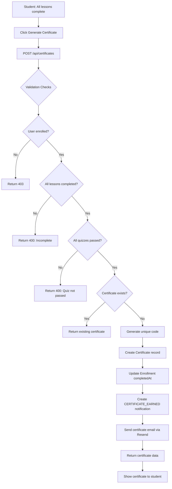
```mermaid
flowchart TD
    A[Student: All lessons complete] --> B["Click Generate Certificate"]
    B --> C["POST /api/certificates"]

    C --> D{Validation Checks}
    D --> E{User enrolled?}
    E -->|No| F[Return 403]
    E -->|Yes| G{All lessons completed?}
    G -->|No| H[Return 400: Incomplete]
    G -->|Yes| I{All quizzes passed?}
    I -->|No| J[Return 400: Quiz not passed]
    I -->|Yes| K{Certificate exists?}
    K -->|Yes| L[Return existing certificate]
    K -->|No| M[Generate unique code]

    M --> N[Create Certificate record]
    N --> O[Update Enrollment completedAt]
    O --> P[Create CERTIFICATE_EARNED notification]
    P --> Q[Send certificate email via Resend]
    Q --> R[Return certificate data]
    R --> S[Show certificate to student]
```

### 7.2 Certificate Verification

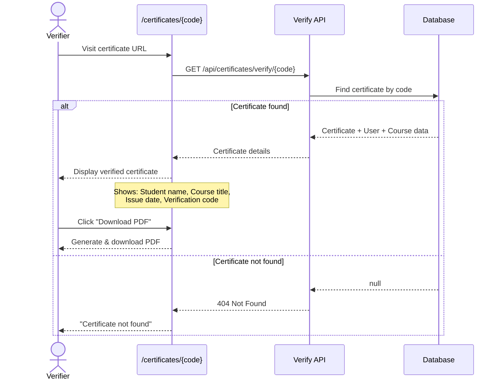
```mermaid
sequenceDiagram
    actor Verifier
    participant Page as /certificates/{code}
    participant API as Verify API
    participant DB as Database

    Verifier->>Page: Visit certificate URL
    Page->>API: GET /api/certificates/verify/{code}
    API->>DB: Find certificate by code

    alt Certificate found
        DB-->>API: Certificate + User + Course data
        API-->>Page: Certificate details
        Page-->>Verifier: Display verified certificate
        Note over Page: Shows: Student name, Course title,<br/>Issue date, Verification code
        Verifier->>Page: Click "Download PDF"
        Page-->>Verifier: Generate & download PDF
    else Certificate not found
        DB-->>API: null
        API-->>Page: 404 Not Found
        Page-->>Verifier: "Certificate not found"
    end
```

---

## 8. Community Flows (Forums & Chat)

### 8.1 Forum Thread Lifecycle

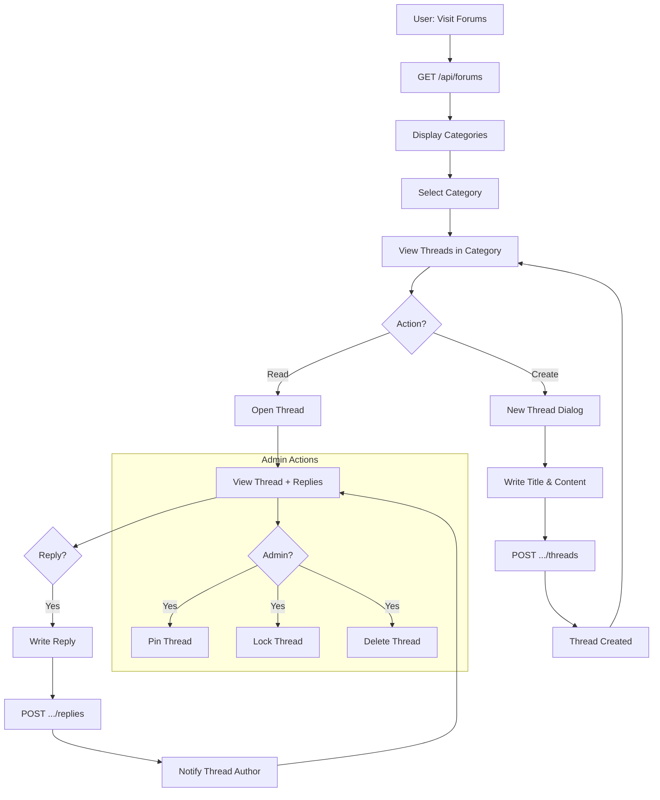
```mermaid
flowchart TD
    A[User: Visit Forums] --> B[GET /api/forums]
    B --> C[Display Categories]
    C --> D[Select Category]
    D --> E[View Threads in Category]

    E --> F{Action?}
    F -->|Read| G[Open Thread]
    F -->|Create| H[New Thread Dialog]

    G --> I[View Thread + Replies]
    I --> J{Reply?}
    J -->|Yes| K[Write Reply]
    K --> L[POST .../replies]
    L --> M[Notify Thread Author]
    M --> I

    H --> N[Write Title & Content]
    N --> O[POST .../threads]
    O --> P[Thread Created]
    P --> E

    subgraph "Admin Actions"
        I --> Q{Admin?}
        Q -->|Yes| R[Pin Thread]
        Q -->|Yes| S[Lock Thread]
        Q -->|Yes| T[Delete Thread]
    end
```

### 8.2 Real-Time Chat Flow

```mermaid
sequenceDiagram
    actor Student
    participant ChatUI as Chat Component
    participant API as Chat API
    participant Pusher as Pusher Server
    participant DB as Database
    actor OtherStudents as Other Students

    Student->>ChatUI: Open course chat room
    ChatUI->>API: GET /api/chat/{roomId}/messages
    API->>DB: Fetch recent messages
    DB-->>API: Message history
    API-->>ChatUI: Display messages

    ChatUI->>Pusher: Subscribe to channel
    Note over ChatUI,Pusher: pusher-js client connects

    Student->>ChatUI: Type message
    ChatUI->>API: POST /api/chat/{roomId}/messages
    API->>DB: Save message
    API->>Pusher: Trigger 'new-message' event
    Pusher-->>ChatUI: Receive own message
    Pusher-->>OtherStudents: Broadcast message

    OtherStudents->>OtherStudents: Display new message in UI
```

### 8.3 Chat Room State

```mermaid
stateDiagram-v2
    [*] --> Disconnected

    Disconnected --> Connecting : Open chat room
    Connecting --> Connected : Pusher authenticated
    Connecting --> Error : Auth failed

    Connected --> Receiving : New message event
    Receiving --> Connected : Message displayed

    Connected --> Sending : User sends message
    Sending --> Connected : Message saved & broadcast
    Sending --> Error : Send failed

    Connected --> Disconnected : Leave room
    Error --> Connecting : Retry
```

---

## 9. Admin Flows

### 9.1 User Management Flow

```mermaid
flowchart TD
    A[Admin Dashboard] --> B[User Management]
    B --> C[GET /api/admin/users]
    C --> D[Display User List]

    D --> E{Search/Filter}
    E --> F[Filter by Role]
    E --> G[Search by Name/Email]
    F & G --> C

    D --> H[Select User]
    H --> I[View User Details]
    I --> J{Action?}

    J -->|Change Role| K[Select New Role]
    K --> L["PUT /api/admin/users/{id}"]
    L --> M[Role Updated]
    M --> N[Audit Log Created]

    J -->|Delete User| O[Confirm Deletion]
    O --> P["DELETE /api/admin/users/{id}"]
    P --> Q[User + Related Data Deleted]
    Q --> N

    J -->|View Details| R[Show Enrollments]
    R --> S[Show Certificates]
    S --> T[Show Activity]
```

### 9.2 Platform Analytics Flow

```mermaid
flowchart TD
    A[Admin: Analytics Page] --> B[GET /api/admin/analytics]

    B --> C{Query Type}
    C -->|overview| D[Platform Metrics]
    C -->|trends| E[Enrollment Trends]
    C -->|top-courses| F[Top Courses]
    C -->|categories| G[Category Distribution]

    D --> H[Total Users]
    D --> I[Total Courses]
    D --> J[Total Enrollments]
    D --> K[Completion Rate]
    D --> L[Active Users 30d]

    E --> M[Daily Enrollments Chart]
    F --> N[Courses by Enrollment Count]
    G --> O[Category Pie Chart]

    H & I & J & K & L & M & N & O --> P[Render Dashboard]
```

---

## 10. API Sequence Diagrams

### 10.1 Course Enrollment Sequence

```mermaid
sequenceDiagram
    actor Student
    participant UI as Course Page
    participant API as Enrollment API
    participant Auth as Auth Middleware
    participant DB as Database
    participant Email as Resend
    participant Notify as Notifications

    Student->>UI: Click "Enroll"
    UI->>API: POST /api/enrollments {courseId}
    API->>Auth: Verify session
    Auth-->>API: {userId, role: STUDENT}

    API->>DB: Check course exists & published
    DB-->>API: Course data

    API->>DB: Check existing enrollment
    DB-->>API: No existing enrollment

    API->>DB: Create Enrollment record
    DB-->>API: Enrollment created

    par Send notifications
        API->>Email: sendEnrollmentEmail(student, course)
        API->>Notify: notifyEnrollment(instructor, student, course)
    end

    API-->>UI: 201 {enrollment}
    UI-->>Student: "Successfully enrolled!"
```

### 10.2 Lesson Content Delivery Sequence

```mermaid
sequenceDiagram
    actor Student
    participant UI as Lesson Viewer
    participant API as Lesson API
    participant DB as Database
    participant CDN as UploadThing CDN

    Student->>UI: Navigate to lesson
    UI->>API: GET /api/courses/{id}/chapters/{id}/lessons/{id}
    API->>DB: Fetch lesson with enrollment check
    DB-->>API: Lesson data

    alt Video Lesson
        API-->>UI: {type: VIDEO, videoUrl}
        UI->>CDN: Stream video
        CDN-->>UI: Video stream
    else PDF Lesson
        API-->>UI: {type: PDF, attachmentUrl}
        UI->>CDN: Fetch PDF
        CDN-->>UI: PDF document
    else 3D Scene
        API-->>UI: {type: SCENE_3D, sceneConfig}
        UI->>UI: Initialize Three.js scene
        UI->>CDN: Load 3D models from URLs
        CDN-->>UI: GLB/GLTF models
    else Text Lesson
        API-->>UI: {type: TEXT, content}
        UI-->>Student: Render markdown/HTML
    end

    Student->>UI: Mark as complete
    UI->>API: POST /api/progress
    API->>DB: Upsert UserProgress
    DB-->>API: Saved
    API-->>UI: {completed: true}
```

### 10.3 Rate Limiting Sequence

```mermaid
sequenceDiagram
    actor Client
    participant MW as Middleware
    participant Redis as Upstash Redis
    participant API as API Route

    Client->>MW: API Request
    MW->>MW: Extract IP (x-forwarded-for / x-real-ip)
    MW->>MW: Determine limiter (auth vs general)

    MW->>Redis: ratelimit.limit(ip)

    alt Rate limit OK
        Redis-->>MW: {success: true, remaining: 95}
        MW->>API: Forward request
        API-->>MW: Response
        MW->>MW: Add X-RateLimit headers
        MW-->>Client: Response with headers
    else Rate limit exceeded
        Redis-->>MW: {success: false, reset: timestamp}
        MW-->>Client: 429 Too Many Requests
        Note over Client: Retry-After header included
    end
```

---

## 11. Data Flow Diagrams

### 11.1 Complete Data Flow

```mermaid
flowchart TD
    subgraph Input["Data Input Sources"]
        A1[User Registration Form]
        A2[Course Creation Form]
        A3[Lesson Content Upload]
        A4[Quiz Answers]
        A5[Chat Messages]
        A6[Forum Posts]
    end

    subgraph Validation["Validation Layer"]
        B1[Zod Schema Validation]
        B2[Auth Session Check]
        B3[Role Permission Check]
    end

    subgraph Processing["Processing Layer"]
        C1[Password Hashing - bcrypt]
        C2[Slug Generation]
        C3[Score Calculation]
        C4[Certificate Code Gen]
        C5[File Upload Processing]
    end

    subgraph Storage["Data Storage"]
        D1[(PostgreSQL - Neon)]
        D2[(Redis - Upstash)]
        D3[(UploadThing - Files)]
    end

    subgraph Output["Data Output"]
        E1[Server-rendered Pages]
        E2[API JSON Responses]
        E3[Email Notifications]
        E4[Real-time Events]
        E5[PDF Certificates]
    end

    A1 & A2 & A3 & A4 & A5 & A6 --> B1
    B1 --> B2
    B2 --> B3
    B3 --> C1 & C2 & C3 & C4 & C5
    C1 & C2 & C3 & C4 --> D1
    C5 --> D3
    D2 --> B3
    D1 --> E1 & E2
    D3 --> E1
    D1 --> E3
    D1 --> E4
    D1 --> E5
```

### 11.2 Database Relationship Map

```mermaid
erDiagram
    User ||--o{ Account : "has OAuth"
    User ||--o{ Enrollment : "enrolls in"
    User ||--o{ Course : "teaches"
    User ||--o{ UserProgress : "tracks"
    User ||--o{ QuizAttempt : "attempts"
    User ||--o{ Certificate : "earns"
    User ||--o{ Notification : "receives"
    User ||--o{ Bookmark : "saves"
    User ||--o{ Note : "writes"
    User ||--o{ CourseReview : "reviews"
    User ||--o{ ForumThread : "creates"
    User ||--o{ ForumReply : "posts"
    User ||--o{ Message : "sends"
    User ||--o{ Media : "uploads"
    User ||--o{ AuditLog : "generates"

    Course ||--o{ Chapter : "contains"
    Course ||--o{ Enrollment : "has"
    Course ||--o{ CourseReview : "receives"
    Course ||--o{ ChatRoom : "has"
    Course }o--|| Category : "belongs to"
    Course ||--o{ CoursePrerequisite : "requires"

    Chapter ||--o{ Lesson : "contains"
    Chapter ||--o| Quiz : "has"

    Quiz ||--o{ Question : "contains"
    Quiz ||--o{ QuizAttempt : "receives"

    Lesson ||--o{ UserProgress : "tracked by"
    Lesson ||--o{ Bookmark : "bookmarked in"
    Lesson ||--o{ Note : "noted in"

    ChatRoom ||--o{ Message : "contains"

    ForumCategory ||--o{ ForumThread : "contains"
    ForumThread ||--o{ ForumReply : "has"

    LearningPath ||--o{ LearningPathCourse : "contains"
    LearningPath ||--o{ LearningPathEnrollment : "has"

    User {
        string id PK
        string email UK
        string name
        string password
        UserRole role
        string image
        string bio
        datetime emailVerified
    }

    Course {
        string id PK
        string title
        string slug UK
        string description
        string imageUrl
        boolean isPublished
        string instructorId FK
        string categoryId FK
    }

    Enrollment {
        string id PK
        string userId FK
        string courseId FK
        datetime completedAt
    }

    Certificate {
        string id PK
        string code UK
        string userId FK
        string courseId FK
        datetime issuedAt
    }
```

### 11.3 Email Notification Data Flow

```mermaid
flowchart LR
    subgraph Triggers["Email Triggers"]
        A[User Registers]
        B[Student Enrolls]
        C[Certificate Earned]
    end

    subgraph EmailService["Email Service (Resend)"]
        D[sendWelcomeEmail]
        E[sendEnrollmentEmail]
        F[sendCertificateEmail]
    end

    subgraph Templates["Email Content"]
        G[Welcome Message + Getting Started]
        H[Course Name + Start Learning Link]
        I[Certificate Link + Verification Code]
    end

    A --> D --> G
    B --> E --> H
    C --> F --> I

    G & H & I --> J[Resend API]
    J --> K[User Inbox]
```

---

## 12. Role-Based Access Control

### 12.1 RBAC Overview

```mermaid
flowchart TD
    subgraph Roles["User Roles"]
        Student[STUDENT]
        Instructor[INSTRUCTOR]
        Admin[ADMIN]
    end

    subgraph StudentAccess["Student Permissions"]
        S1[Browse Published Courses]
        S2[Enroll in Courses]
        S3[View Lessons]
        S4[Take Quizzes]
        S5[Track Progress]
        S6[Generate Certificates]
        S7[Post in Forums]
        S8[Use Course Chat]
        S9[Bookmarks & Notes]
        S10[Write Reviews]
    end

    subgraph InstructorAccess["Instructor Permissions"]
        I1[Create Courses]
        I2[Edit Own Courses]
        I3[Create Chapters & Lessons]
        I4[Create Quizzes]
        I5[Publish/Unpublish Courses]
        I6[Upload Media]
        I7[View Course Analytics]
        I8[Access Media Library]
    end

    subgraph AdminAccess["Admin Permissions"]
        A1[Manage All Users]
        A2[Change User Roles]
        A3[Delete Users/Courses]
        A4[Manage Categories]
        A5[Manage Forum Categories]
        A6[Moderate Forums]
        A7[View Platform Analytics]
        A8[Generate Reports]
        A9[View Audit Logs]
    end

    Student --> StudentAccess
    Instructor --> StudentAccess
    Instructor --> InstructorAccess
    Admin --> StudentAccess
    Admin --> InstructorAccess
    Admin --> AdminAccess
```

### 12.2 Route Protection Matrix

```mermaid
flowchart TD
    A[Incoming Request] --> B{Authenticated?}
    B -->|No| C{Public Route?}
    C -->|Yes| D[Allow Access]
    C -->|No| E[Redirect to /login]

    B -->|Yes| F{Route Type?}

    F -->|/student/*| G{Role = STUDENT?}
    G -->|Yes| D
    G -->|No| H{Role = INSTRUCTOR or ADMIN?}
    H -->|Yes| D
    H -->|No| I[Redirect to Dashboard]

    F -->|/instructor/*| J{Role = INSTRUCTOR?}
    J -->|Yes| D
    J -->|No| K{Role = ADMIN?}
    K -->|Yes| D
    K -->|No| I

    F -->|/admin/*| L{Role = ADMIN?}
    L -->|Yes| D
    L -->|No| I

    F -->|/courses, /forums, /chat| D
```

### 12.3 API Authorization Flow

```mermaid
sequenceDiagram
    actor User
    participant API as API Route
    participant Auth as auth()
    participant DB as Database

    User->>API: Request with session cookie
    API->>Auth: const session = await auth()

    alt No session
        Auth-->>API: null
        API-->>User: 401 Unauthorized
    else Has session
        Auth-->>API: {user: {id, email, role}}

        API->>API: Check role permissions

        alt Insufficient role
            API-->>User: 403 Forbidden
        else Authorized
            API->>DB: Execute query

            alt Resource ownership check
                API->>API: Verify user owns resource
                Note over API: e.g., instructor owns course
            end

            DB-->>API: Data
            API-->>User: 200 OK + Data
        end
    end
```

---

## 13. State Diagrams

### 13.1 Course Lifecycle States

```mermaid
stateDiagram-v2
    [*] --> Created : Instructor creates course

    Created --> HasChapters : Add chapters
    HasChapters --> HasContent : Add lessons/quizzes
    HasContent --> Published : Publish

    Published --> HasEnrollments : Students enroll
    HasEnrollments --> Active : Students learning
    Active --> Active : New enrollments

    Published --> Unpublished : Instructor unpublishes
    Unpublished --> Published : Re-publish

    Created --> Deleted : Delete (no enrollments)
    HasChapters --> Deleted : Delete
    HasContent --> Deleted : Delete
    Published --> Deleted : Admin force delete
    Deleted --> [*]
```

### 13.2 Student Enrollment Lifecycle

```mermaid
stateDiagram-v2
    [*] --> Browsing : Student views course catalog

    Browsing --> ViewingCourse : Select course
    ViewingCourse --> Browsing : Back to catalog
    ViewingCourse --> Enrolled : Click Enroll

    Enrolled --> Learning : Start first lesson

    state Learning {
        [*] --> ViewingLesson
        ViewingLesson --> LessonCompleted : Mark complete
        LessonCompleted --> ViewingLesson : Next lesson
        LessonCompleted --> TakingQuiz : Chapter quiz available
        TakingQuiz --> QuizPassed : Score >= passing
        TakingQuiz --> QuizFailed : Score < passing
        QuizFailed --> TakingQuiz : Retry
        QuizPassed --> ViewingLesson : Next chapter
        QuizPassed --> AllComplete : Last chapter done
    }

    AllComplete --> Certified : Generate certificate
    Certified --> [*]
```

### 13.3 Notification States

```mermaid
stateDiagram-v2
    [*] --> Created : Event triggers notification

    Created --> Unread : Stored in DB
    Unread --> Read : User clicks notification
    Read --> [*]

    state "Notification Types" as Types {
        [*] --> WELCOME
        [*] --> ENROLLMENT
        [*] --> COURSE_PUBLISHED
        [*] --> CERTIFICATE_EARNED
        [*] --> QUIZ_PASSED
        [*] --> QUIZ_FAILED
        [*] --> FORUM_REPLY
        [*] --> COURSE_UPDATE
        [*] --> ANNOUNCEMENT
    }
```

### 13.4 Quiz Attempt States

```mermaid
stateDiagram-v2
    [*] --> NotAttempted

    NotAttempted --> InProgress : Start quiz

    state InProgress {
        [*] --> Question1
        Question1 --> Question2 : Answer
        Question2 --> QuestionN : Answer
        QuestionN --> Submitted : Submit all
    }

    Submitted --> Scoring : Calculate score
    Scoring --> Passed : score >= passingScore
    Scoring --> Failed : score < passingScore

    Failed --> InProgress : Retry
    Passed --> [*] : Quiz complete

    state "Attempt Record" as Record {
        Score : Numeric score
        Answers : JSON answer array
        Timestamp : Attempt time
    }
```

---

## 14. 3D Scene Flows

### 14.1 3D Scene Creation Flow

```mermaid
flowchart TD
    A[Instructor: Create 3D Lesson] --> B[Open Scene Editor]

    B --> C[Configure Camera]
    C --> D{Camera Type}
    D -->|Perspective| E[Set FOV, Near, Far]
    D -->|Orthographic| F[Set Zoom, Near, Far]

    E & F --> G[Configure Controls]
    G --> H{Control Type}
    H -->|Orbit| I[Set target, speeds, limits]
    H -->|Fly| J[Set speed, dampening]
    H -->|First Person| K[Set height, speed]

    I & J & K --> L[Configure Environment]
    L --> M[Set Background/Preset]
    M --> N[Configure Fog/Ground]

    N --> O[Add Scene Objects]
    O --> P{Object Type}
    P -->|3D Model| Q[Upload GLB/GLTF/OBJ/FBX]
    P -->|Primitive| R[Select Shape]
    P -->|Light| S[Configure Light]
    P -->|Annotation| T[Add Hotspot]

    Q --> U[Set Transform: position, rotation, scale]
    R --> V[Set Material: color, metalness, roughness]
    S --> W[Set intensity, color, shadows]
    T --> X[Set label, description, camera position]

    U & V & W & X --> Y{More objects?}
    Y -->|Yes| O
    Y -->|No| Z[Save SceneConfig as JSON]
    Z --> AA[Lesson Saved]
```

### 14.2 3D Scene Rendering Flow

```mermaid
flowchart TD
    A[Student Opens 3D Lesson] --> B[Load SceneConfig JSON]
    B --> C[Initialize Three.js Canvas]

    C --> D[Setup Camera]
    D --> E[Setup Controls]
    E --> F[Setup Environment]

    F --> G[Load Scene Objects]
    G --> H{For each object}

    H -->|Model| I[ModelLoader: fetch GLB/GLTF]
    H -->|Primitive| J[PrimitiveObject: create geometry]
    H -->|Light| K[SceneLights: create light]
    H -->|Annotation| L[Annotations: create hotspot]

    I --> M[Apply transforms]
    J --> N[Apply materials]
    K --> O[Apply shadow settings]
    L --> P[Position in 3D space]

    M & N & O & P --> Q[Render Loop]
    Q --> R[User Interaction]
    R --> S{Action}
    S -->|Orbit/Pan/Zoom| T[Update camera]
    S -->|Click Annotation| U[Animate to position]
    S -->|Click Object| V[Show info panel]
    T & U & V --> Q
```

### 14.3 3D Object Hierarchy

```mermaid
graph TD
    subgraph SceneConfig
        A[Scene Root]
        A --> B[Camera Config]
        A --> C[Controls Config]
        A --> D[Environment Config]
        A --> E[Objects Array]
    end

    subgraph Objects
        E --> F[Object 1: Model]
        E --> G[Object 2: Primitive]
        E --> H[Object 3: Light]
        E --> I[Object 4: Annotation]
        E --> J[Object 5: Group]
        J --> K[Child Object 1]
        J --> L[Child Object 2]
    end

    subgraph ObjectProperties
        F --> M[Transform]
        F --> N[ModelConfig: url, format, animations]
        G --> O[Transform]
        G --> P[PrimitiveConfig: type, dimensions]
        G --> Q[Material: color, metalness, roughness]
        H --> R[LightConfig: type, intensity, shadows]
        I --> S[AnnotationConfig: label, cameraPosition]
    end
```

---

## 15. Notification System

### 15.1 Notification Trigger Map

```mermaid
flowchart TD
    subgraph Events["Trigger Events"]
        E1[User Registers]
        E2[Student Enrolls]
        E3[Course Published]
        E4[Quiz Passed]
        E5[Quiz Failed]
        E6[Certificate Earned]
        E7[Forum Reply]
        E8[Course Updated]
        E9[Admin Announcement]
    end

    subgraph NotifyService["Notification Service"]
        N1[notifyWelcome]
        N2[notifyEnrollment]
        N3[notifyCoursePublished]
        N4[notifyQuizResult - Pass]
        N5[notifyQuizResult - Fail]
        N6[notifyCertificateEarned]
        N7[notifyForumReply]
        N8[notifyCourseUpdate]
        N9[notifyAnnouncement]
    end

    subgraph Recipients["Recipients"]
        R1[New User]
        R2[Course Instructor]
        R3[Enrolled Students]
        R4[Quiz Taker]
        R5[Certificate Earner]
        R6[Thread Author]
        R7[All Users]
    end

    E1 --> N1 --> R1
    E2 --> N2 --> R2
    E3 --> N3 --> R3
    E4 --> N4 --> R4
    E5 --> N5 --> R4
    E6 --> N6 --> R5
    E7 --> N7 --> R6
    E8 --> N8 --> R3
    E9 --> N9 --> R7
```

### 15.2 Notification Delivery Flow

```mermaid
sequenceDiagram
    participant Event as System Event
    participant Service as Notification Service
    participant DB as Database
    participant Bell as Notification Bell
    participant User as User

    Event->>Service: Trigger notification
    Service->>DB: Create Notification record
    Note over DB: {type, title, message, link, userId, isRead: false}
    DB-->>Service: Notification created

    User->>Bell: View notification count
    Bell->>DB: getUnreadCount(userId)
    DB-->>Bell: count: 3
    Bell-->>User: Show badge "3"

    User->>Bell: Click bell icon
    Bell->>DB: GET /api/notifications
    DB-->>Bell: Notification list
    Bell-->>User: Display notifications

    User->>Bell: Click notification
    Bell->>DB: POST /api/notifications/{id} (mark read)
    DB-->>Bell: Updated
    Bell-->>User: Navigate to link
```

---

## 16. Media & Upload Flows

### 16.1 File Upload Flow

```mermaid
flowchart TD
    A[User: Select File] --> B{File Type?}

    B -->|Image| C[Image Upload Component]
    B -->|Video| D[Video Upload Component]
    B -->|Document| E[File Upload Component]
    B -->|3D Model| F[Model Upload Component]

    C & D & E & F --> G[UploadThing Client]
    G --> H[POST /api/uploadthing]
    H --> I[UploadThing Server]
    I --> J{Validate}
    J -->|Size OK| K{Type OK}
    J -->|Too large| L[Return Error]
    K -->|Valid| M[Upload to CDN]
    K -->|Invalid type| L

    M --> N[Return URL]
    N --> O[Save URL to Database]
    O --> P{Context?}
    P -->|Course thumbnail| Q[Update Course.imageUrl]
    P -->|Lesson video| R[Update Lesson.videoUrl]
    P -->|Lesson attachment| S[Update Lesson.attachmentUrl]
    P -->|3D Model| T[Store in SceneConfig]
    P -->|Media library| U[Create Media record]
```

### 16.2 Media Library Flow

```mermaid
flowchart TD
    A[Instructor: Media Library] --> B[GET /api/media]
    B --> C[Display Media Grid]

    C --> D{Action?}
    D -->|Upload| E[Select File]
    E --> F[Upload via UploadThing]
    F --> G[POST /api/media]
    G --> H[Create Media Record]
    H --> C

    D -->|Delete| I[Confirm Delete]
    I --> J["DELETE /api/media/{id}"]
    J --> K[Remove from DB]
    K --> C

    D -->|Use in Lesson| L[Copy URL]
    L --> M[Paste in Lesson Editor]

    subgraph MediaTypes["Supported Types"]
        T1[IMAGE: jpg, png, gif, webp]
        T2[VIDEO: mp4, webm, mov]
        T3[DOCUMENT: pdf, doc, ppt]
        T4[MODEL_3D: glb, gltf, obj, fbx]
        T5[OTHER: zip, etc.]
    end
```

---

## 17. MFA & Security Flows

### 17.1 Email OTP Verification Flow

```mermaid
sequenceDiagram
    actor User
    participant Settings as MFA Settings Page
    participant API as MFA API
    participant DB as Database
    participant Email as Resend Email
    participant Redis as Rate Limiter

    User->>Settings: Enable MFA
    Settings->>API: POST /api/auth/mfa/setup
    API->>DB: Create MFAConfig (method: EMAIL, verified: false)
    API->>API: Generate 6-digit OTP
    API->>DB: Store OTP hash + expiry (10 min)
    API->>Email: Send OTP to user email
    Email-->>User: Email with 6-digit code
    API-->>Settings: {message: "OTP sent"}

    User->>Settings: Enter OTP code
    Settings->>API: POST /api/auth/mfa/verify {code}
    API->>Redis: Check rate limit (5 attempts max)

    alt Rate limit exceeded
        Redis-->>API: {blocked: true}
        API-->>Settings: 429 Too Many Requests
    else Within limit
        API->>DB: Fetch stored OTP hash
        API->>API: Compare OTP hash

        alt OTP valid
            API->>DB: Set MFAConfig.verified = true
            API->>DB: Generate 10 backup codes
            API-->>Settings: {success: true, backupCodes: [...]}
            Settings-->>User: Show backup codes (one-time display)
        else OTP invalid or expired
            API->>Redis: Increment failure count
            API-->>Settings: {error: "Invalid or expired code"}
        end
    end
```

### 17.2 MFA Login Challenge Flow

```mermaid
flowchart TD
    A[User: Enter credentials] --> B[POST /api/auth/callback/credentials]
    B --> C{Credentials valid?}
    C -->|No| D[Return auth error]
    C -->|Yes| E{MFA enabled for user?}

    E -->|No| F[Create session, redirect to dashboard]
    E -->|Yes| G[Create pending session token]
    G --> H[Redirect to /auth/mfa-challenge]

    H --> I[Display MFA input form]
    I --> J{Input type?}
    J -->|OTP| K[User enters 6-digit code]
    J -->|Backup Code| L[User enters backup code]

    K --> M[POST /api/auth/mfa/challenge]
    L --> N[POST /api/auth/mfa/backup]

    M --> O{OTP valid?}
    N --> P{Backup code valid?}

    O -->|Yes| Q[Upgrade to full session]
    O -->|No| R[Increment failure count]
    P -->|Yes| S[Mark backup code as used]
    P -->|No| R

    S --> Q
    Q --> F

    R --> T{Failures >= 5?}
    T -->|Yes| U[Lock account 15 min]
    T -->|No| I

    U --> V[Notify user via email]
    V --> W[Show lockout message]
```

### 17.3 Backup Codes Management Flow

```mermaid
flowchart TD
    A[MFA Setup Complete] --> B[Generate 10 backup codes]
    B --> C[Hash each code with bcrypt]
    C --> D[Store hashes in MFAConfig.backupCodes]
    D --> E[Display plain codes to user ONCE]
    E --> F[User saves codes securely]

    subgraph "Backup Code Usage"
        G[User locked out of email] --> H[Enter backup code]
        H --> I[POST /api/auth/mfa/backup]
        I --> J[Iterate through stored hashes]
        J --> K{Any hash matches?}
        K -->|Yes| L[Remove used code from array]
        L --> M[Update MFAConfig]
        M --> N[Grant access]
        K -->|No| O[Return error]
    end

    subgraph "Regenerate Codes"
        P[User: Regenerate codes] --> Q[Require current MFA verification]
        Q --> R[Generate new 10 codes]
        R --> S[Replace all existing codes]
        S --> T[Display new codes ONCE]
    end
```

### 17.4 Account Lockout State Diagram

```mermaid
stateDiagram-v2
    [*] --> Normal

    Normal --> Attempt1 : Failed MFA attempt
    Attempt1 --> Attempt2 : Failed MFA attempt
    Attempt2 --> Attempt3 : Failed MFA attempt
    Attempt3 --> Attempt4 : Failed MFA attempt
    Attempt4 --> Attempt5 : Failed MFA attempt
    Attempt5 --> Locked : 5th failure triggers lockout

    Attempt1 --> Normal : Successful verification
    Attempt2 --> Normal : Successful verification
    Attempt3 --> Normal : Successful verification
    Attempt4 --> Normal : Successful verification

    Locked --> Cooldown : Lockout initiated

    state Cooldown {
        [*] --> Timer15Min
        Timer15Min --> Unlocking : 15 minutes elapsed
    }

    Cooldown --> Normal : Timer complete
    Locked --> Normal : Admin manual unlock

    Note right of Locked : Email notification sent
    Note right of Locked : Audit log created
```

---

## 18. Course Approval Workflow

### 18.1 Course Submission & Review Flow

```mermaid
flowchart TD
    A[Instructor: Course ready] --> B{Approval required?}
    B -->|No - Admin setting off| C[Direct publish]
    B -->|Yes| D[Submit for approval]

    D --> E[POST /api/courses/{id}/approval/submit]
    E --> F[Create CourseApproval record]
    F --> G[Set status = PENDING]
    G --> H[Record submission timestamp]
    H --> I[Notify all admins]

    subgraph "Admin Review"
        J[Admin: Open review queue] --> K[GET /api/admin/approvals?status=PENDING]
        K --> L[Display pending courses]
        L --> M[Select course to review]
        M --> N[View course content]
        N --> O{Decision?}

        O -->|Approve| P[POST .../approval/approve]
        O -->|Reject| Q[POST .../approval/reject {reason}]
        O -->|Request Changes| R[POST .../approval/changes {feedback}]
    end

    P --> S[Set status = APPROVED]
    S --> T[Auto-publish course]
    T --> U[Notify instructor: Approved]

    Q --> V[Set status = REJECTED]
    V --> W[Store rejection reason]
    W --> X[Notify instructor: Rejected]

    R --> Y[Set status = CHANGES_REQUESTED]
    Y --> Z[Store feedback in history]
    Z --> AA[Notify instructor: Changes needed]
    AA --> AB[Instructor makes changes]
    AB --> D
```

### 18.2 Course Approval State Diagram

```mermaid
stateDiagram-v2
    [*] --> Draft : Course created

    Draft --> Draft : Edit content
    Draft --> PendingApproval : Submit for approval

    PendingApproval --> Approved : Admin approves
    PendingApproval --> Rejected : Admin rejects
    PendingApproval --> ChangesRequested : Admin requests changes

    ChangesRequested --> Draft : Instructor edits
    Rejected --> Draft : Instructor revises

    Approved --> Published : Auto-publish
    Published --> Draft : Unpublish for edits

    state PendingApproval {
        [*] --> InQueue
        InQueue --> UnderReview : Admin opens
        UnderReview --> Decision : Review complete
    }

    state "Approval History" as History {
        SubmittedAt : Timestamp
        ReviewedBy : Admin ID
        Decision : APPROVED/REJECTED/CHANGES
        Comments : Feedback text
    }
```

### 18.3 Approval History Tracking

```mermaid
sequenceDiagram
    participant Instructor
    participant API as Approval API
    participant DB as Database
    participant Admin
    participant Notify as Notifications

    Instructor->>API: Submit course for approval
    API->>DB: Create CourseApproval
    Note over DB: status: PENDING<br/>history: [{action: SUBMITTED, timestamp, userId}]
    API->>Notify: notifyAdmins("New course pending")

    Admin->>API: Request changes
    API->>DB: Update CourseApproval
    Note over DB: status: CHANGES_REQUESTED<br/>history: [..., {action: CHANGES_REQUESTED, feedback, timestamp, adminId}]
    API->>Notify: notifyInstructor("Changes requested")

    Instructor->>API: Resubmit course
    API->>DB: Update CourseApproval
    Note over DB: status: PENDING<br/>history: [..., {action: RESUBMITTED, timestamp, userId}]

    Admin->>API: Approve course
    API->>DB: Update CourseApproval
    Note over DB: status: APPROVED<br/>history: [..., {action: APPROVED, timestamp, adminId}]
    API->>DB: Set course.isPublished = true
    API->>Notify: notifyInstructor("Course approved!")
```

---

## 19. Email Campaign Flows

### 19.1 Campaign Creation & Sending Flow

```mermaid
flowchart TD
    A[Admin: Create Campaign] --> B[Fill campaign form]
    B --> C[Set subject & body]
    C --> D[Select recipient segment]

    D --> E{Segment type?}
    E -->|All Users| F[Query all active users]
    E -->|By Role| G[Filter by STUDENT/INSTRUCTOR]
    E -->|By Course| H[Filter by enrollment]
    E -->|By Activity| I[Filter by lastActiveAt]
    E -->|Custom| J[Upload email list]

    F & G & H & I & J --> K[Preview recipient count]
    K --> L{Schedule?}

    L -->|Send now| M[POST /api/admin/campaigns]
    L -->|Schedule| N[Set scheduledFor datetime]
    N --> O[POST /api/admin/campaigns {scheduledFor}]

    M --> P[Create EmailCampaign record]
    P --> Q[Set status = SENDING]
    Q --> R[Begin batch processing]

    O --> S[Create EmailCampaign record]
    S --> T[Set status = SCHEDULED]
    T --> U[Vercel cron picks up at scheduledFor]
    U --> R

    subgraph "Batch Processing"
        R --> V[Fetch 50 recipients]
        V --> W[Send via Resend batch API]
        W --> X[Record delivery status]
        X --> Y{More recipients?}
        Y -->|Yes| Z[Wait 1 second]
        Z --> V
        Y -->|No| AA[Set status = COMPLETED]
    end
```

### 19.2 Campaign Execution Sequence

```mermaid
sequenceDiagram
    participant Cron as Vercel Cron
    participant API as Campaign API
    participant DB as Database
    participant Resend as Resend API
    participant Users as Recipients

    Cron->>API: GET /api/cron/campaigns (every 5 min)
    API->>DB: Find SCHEDULED campaigns where scheduledFor <= now
    DB-->>API: [campaign1, campaign2]

    loop For each campaign
        API->>DB: Set status = SENDING
        API->>DB: Fetch recipient emails (paginated)

        loop Batch of 50
            API->>Resend: POST /emails/batch
            Note over Resend: 50 personalized emails
            Resend-->>API: {id, status} for each
            API->>DB: Update sentCount, failedCount
            API->>API: Sleep 1 second (rate limit)
        end

        API->>DB: Set status = COMPLETED
        API->>DB: Record completedAt timestamp
    end

    Resend->>Users: Deliver emails
```

### 19.3 Campaign State Diagram

```mermaid
stateDiagram-v2
    [*] --> Draft : Create campaign

    Draft --> Scheduled : Schedule for later
    Draft --> Sending : Send immediately

    Scheduled --> Sending : Cron triggers at scheduledFor
    Scheduled --> Draft : Edit before send time
    Scheduled --> Cancelled : Admin cancels

    Sending --> Completed : All emails processed
    Sending --> PartialFailure : Some emails failed

    PartialFailure --> Completed : Retry exhausted

    Completed --> [*]
    Cancelled --> [*]

    state Sending {
        [*] --> Batching
        Batching --> Waiting : Batch sent
        Waiting --> Batching : Rate limit cooldown
        Batching --> Done : No more recipients
    }

    state "Campaign Metrics" as Metrics {
        TotalRecipients : Count
        SentCount : Delivered
        FailedCount : Bounced/Failed
        OpenRate : Tracked opens
    }
```

---

## 20. Data Retention & GDPR Flows

### 20.1 User Data Export Flow (GDPR Article 15)

```mermaid
flowchart TD
    A[User: Request my data] --> B[Click "Export My Data"]
    B --> C[POST /api/settings/privacy/export]

    C --> D{Rate limit check}
    D -->|Exceeded| E[Return 429: Try again later]
    D -->|OK| F[Begin data collection]

    F --> G[Fetch User record]
    G --> H[Fetch Enrollments]
    H --> I[Fetch Progress records]
    I --> J[Fetch Quiz attempts]
    J --> K[Fetch Certificates]
    K --> L[Fetch Notes & Bookmarks]
    L --> M[Fetch Forum posts]
    M --> N[Fetch Chat messages]
    N --> O[Fetch Notifications]

    O --> P[Compile JSON package]
    P --> Q[Add export metadata]
    Q --> R[Create audit log entry]
    R --> S[Return JSON download]
    S --> T[User downloads file]

    subgraph "Export Package Structure"
        U[user_export.json]
        U --> V[profile: {name, email, bio, createdAt}]
        U --> W[enrollments: [{course, enrolledAt, progress}]]
        U --> X[certificates: [{course, issuedAt, code}]]
        U --> Y[learning: {notes: [], bookmarks: []}]
        U --> Z[activity: {quizAttempts, forumPosts, messages}]
    end
```

### 20.2 Account Deletion Flow (GDPR Article 17)

```mermaid
sequenceDiagram
    actor User
    participant Settings as Privacy Settings
    participant API as Deletion API
    participant DB as Database
    participant Audit as Audit Log
    participant Email as Resend

    User->>Settings: Request account deletion
    Settings->>API: POST /api/settings/privacy/delete
    API->>API: Require password confirmation

    alt Password incorrect
        API-->>Settings: 401 Invalid password
    else Password correct
        API->>DB: Begin transaction

        Note over DB: Anonymization (not hard delete)
        API->>DB: User.name = "Deleted User"
        API->>DB: User.email = "deleted_{uuid}@anon.local"
        API->>DB: User.password = null
        API->>DB: User.image = null
        API->>DB: User.bio = null

        API->>DB: Delete Account records (OAuth)
        API->>DB: Delete NotificationPreference
        API->>DB: Delete ConsentRecord

        Note over DB: Preserve for integrity
        API->>DB: Keep Enrollments (anonymized)
        API->>DB: Keep Certificates (anonymized)
        API->>DB: Keep QuizAttempts (for course stats)

        API->>DB: Commit transaction
        API->>Audit: Log ACCOUNT_DELETED event
        API->>Email: Send confirmation email (to original)

        API-->>Settings: {success: true}
        Settings->>Settings: Clear session
        Settings-->>User: Redirect to goodbye page
    end
```

### 20.3 Automated Retention Policy Flow

```mermaid
flowchart TD
    A[Vercel Cron: Weekly] --> B[GET /api/cron/retention]
    B --> C[Fetch all RetentionPolicy records]

    C --> D{For each policy}
    D --> E{Data type?}

    E -->|AUDIT_LOGS| F[Delete where createdAt < now - retentionDays]
    E -->|USER_ACTIVITY| G[Delete where timestamp < now - retentionDays]
    E -->|NOTIFICATIONS| H[Delete where createdAt < now - retentionDays AND isRead = true]
    E -->|CHAT_MESSAGES| I[Delete where createdAt < now - retentionDays]
    E -->|WEBHOOK_DELIVERIES| J[Delete where createdAt < now - retentionDays]

    F & G & H & I & J --> K[Record deletion count]
    K --> L{More policies?}
    L -->|Yes| D
    L -->|No| M[Create summary audit log]
    M --> N[Return completion status]

    subgraph "Default Retention Periods"
        O[AUDIT_LOGS: 365 days]
        P[USER_ACTIVITY: 90 days]
        Q[NOTIFICATIONS: 30 days]
        R[CHAT_MESSAGES: 180 days]
        S[WEBHOOK_DELIVERIES: 30 days]
    end
```

### 20.4 Consent Management Flow

```mermaid
stateDiagram-v2
    [*] --> NoConsent : New user

    NoConsent --> ConsentPrompt : First login

    ConsentPrompt --> AllAccepted : Accept all
    ConsentPrompt --> CustomSelection : Customize
    ConsentPrompt --> AllRejected : Reject optional

    CustomSelection --> PartialConsent : Save preferences
    AllAccepted --> FullConsent : Save all granted
    AllRejected --> MinimalConsent : Save required only

    state "Consent Types" as Types {
        Required : Terms of Service (mandatory)
        Analytics : Usage analytics
        Marketing : Marketing emails
        ThirdParty : Third-party integrations
    }

    FullConsent --> UpdatePreferences : User changes mind
    PartialConsent --> UpdatePreferences : User changes mind
    MinimalConsent --> UpdatePreferences : User changes mind
    UpdatePreferences --> PartialConsent : New selection saved

    Note right of FullConsent : All ConsentRecord entries = true
    Note right of MinimalConsent : Only TERMS_OF_SERVICE = true
```

---

## 21. Calendar & Scheduling Flows

### 21.1 Calendar Event Creation Flow

```mermaid
flowchart TD
    A{Event source?}

    A -->|Manual| B[User creates event]
    A -->|Auto-sync| C[System generates from course data]

    B --> D[POST /api/calendar]
    D --> E{Event type?}
    E -->|ASSIGNMENT_DUE| F[Link to Assignment]
    E -->|QUIZ_DUE| G[Link to Quiz]
    E -->|LECTURE| H[Set recurrence pattern]
    E -->|OFFICE_HOURS| I[Set instructor availability]
    E -->|PERSONAL| J[Private to user]
    E -->|COURSE_EVENT| K[Visible to enrolled students]

    F & G & H & I & J & K --> L[Validate date range]
    L --> M[Create CalendarEvent record]
    M --> N[Trigger notifications if enabled]

    C --> O{Sync trigger?}
    O -->|Assignment created| P[Create ASSIGNMENT_DUE event]
    O -->|Quiz published| Q[Create QUIZ_DUE event]
    O -->|Announcement scheduled| R[Create ANNOUNCEMENT event]

    P & Q & R --> M
```

### 21.2 iCal Subscription Flow

```mermaid
sequenceDiagram
    actor User
    participant Settings as Calendar Settings
    participant API as Calendar API
    participant DB as Database
    participant External as Google Calendar/Outlook

    User->>Settings: Click "Subscribe to Calendar"
    Settings->>API: POST /api/calendar/subscribe
    API->>DB: Check existing CalendarToken

    alt Token exists
        DB-->>API: Existing token
    else No token
        API->>API: Generate unique token (uuid)
        API->>DB: Create CalendarToken {userId, token}
        DB-->>API: New token
    end

    API-->>Settings: {icalUrl: "/api/calendar/ical/{token}"}
    Settings-->>User: Display subscription URL

    User->>External: Add calendar subscription
    External->>API: GET /api/calendar/ical/{token}
    API->>DB: Find user by token
    API->>DB: Fetch user's calendar events
    DB-->>API: Events list
    API->>API: Generate iCal format (VCALENDAR)
    API-->>External: iCal file (text/calendar)
    External-->>User: Events appear in calendar app

    Note over External,API: External calendars refresh periodically (15-60 min)
```

### 21.3 Calendar View Data Flow

```mermaid
flowchart TD
    A[User opens Calendar page] --> B[GET /api/calendar?start=X&end=Y]

    B --> C{User role?}
    C -->|Student| D[Fetch personal events]
    C -->|Instructor| E[Fetch personal + course events]
    C -->|Admin| F[Fetch all visible events]

    D --> G[Query CalendarEvent where userId = user OR enrolled courses]
    E --> H[Query CalendarEvent where userId = user OR instructorId = user]
    F --> I[Query all non-private events]

    G & H & I --> J[Filter by date range]
    J --> K[Group by event type]
    K --> L[Apply color coding]

    L --> M[Return to FullCalendar component]
    M --> N{View mode?}
    N -->|Month| O[Render month grid]
    N -->|Week| P[Render week columns]
    N -->|Day| Q[Render hourly slots]
    N -->|Agenda| R[Render list view]

    subgraph "Event Colors"
        S[ASSIGNMENT_DUE: Red]
        T[QUIZ_DUE: Orange]
        U[LECTURE: Blue]
        V[OFFICE_HOURS: Green]
        W[PERSONAL: Purple]
        X[COURSE_EVENT: Teal]
    end
```

### 21.4 Upcoming Deadlines Widget Flow

```mermaid
flowchart TD
    A[Dashboard loads] --> B[GET /api/calendar/upcoming?days=7]

    B --> C[Calculate date range]
    C --> D[Query events where:]
    D --> E[startTime BETWEEN now AND now+7days]
    E --> F[AND type IN (ASSIGNMENT_DUE, QUIZ_DUE)]
    F --> G[AND user is enrolled in course]

    G --> H[Order by startTime ASC]
    H --> I[Limit to 10 items]
    I --> J[Include course info]

    J --> K[Return to widget]
    K --> L{Any deadlines?}
    L -->|Yes| M[Render deadline cards]
    L -->|No| N[Show "No upcoming deadlines"]

    M --> O[For each deadline]
    O --> P[Show: Title, Course, Due date]
    P --> Q[Calculate: "Due in X days/hours"]
    Q --> R[Color code urgency]

    subgraph "Urgency Colors"
        S[> 3 days: Green]
        T[1-3 days: Yellow]
        U[< 24 hours: Red]
        V[Overdue: Dark red]
    end
```

---

## 22. Groups & Collaboration Flows

### 22.1 Group Creation & Management Flow

```mermaid
flowchart TD
    A[Instructor: Manage Groups] --> B[GET /api/courses/{id}/groups]
    B --> C[Display existing groups]

    C --> D{Action?}
    D -->|Create| E[Open create dialog]
    D -->|Auto-assign| F[Open auto-assign dialog]
    D -->|Edit| G[Edit group details]
    D -->|Delete| H[Delete group]

    E --> I[Set name, maxMembers]
    I --> J[POST /api/courses/{id}/groups]
    J --> K[Create CourseGroup record]
    K --> C

    F --> L{Assignment method?}
    L -->|Random| M[Shuffle enrolled students]
    L -->|Balanced| N[Distribute by performance]

    M & N --> O[Calculate group sizes]
    O --> P[POST .../groups/auto-assign]
    P --> Q[Create groups + memberships]
    Q --> R[Notify students of assignment]
    R --> C

    G --> S[PUT .../groups/{groupId}]
    H --> T[DELETE .../groups/{groupId}]
    S & T --> C
```

### 22.2 Group Membership Flow

```mermaid
sequenceDiagram
    actor Instructor
    actor Student
    participant API as Groups API
    participant DB as Database
    participant Notify as Notifications

    Instructor->>API: Add student to group
    API->>DB: Check group capacity

    alt Group full
        DB-->>API: maxMembers reached
        API-->>Instructor: 400 Group is full
    else Has space
        API->>DB: Create GroupMember {groupId, userId, role: MEMBER}
        API->>Notify: Notify student of group assignment
        API-->>Instructor: Member added
    end

    Instructor->>API: Set group leader
    API->>DB: Update GroupMember.role = LEADER
    API->>Notify: Notify student of leader role

    Student->>API: View my groups
    API->>DB: Find GroupMember where userId = student
    DB-->>API: Groups with members list
    API-->>Student: Display group info + teammates

    Instructor->>API: Remove student from group
    API->>DB: Delete GroupMember record
    API->>Notify: Notify student of removal
```

### 22.3 Group Assignment Submission Flow

```mermaid
flowchart TD
    A[Assignment: Group submission enabled] --> B[Student opens assignment]
    B --> C{In a group?}
    C -->|No| D[Show: "Join a group to submit"]
    C -->|Yes| E[Show submission form]

    E --> F[Student submits work]
    F --> G[POST /api/.../submissions]
    G --> H[Create AssignmentSubmission]
    H --> I[Link to groupId]
    I --> J[Set submittedBy = current user]

    J --> K[For each group member]
    K --> L[Create submission reference]
    L --> M[All members see same submission]

    M --> N[Instructor grades]
    N --> O[Grade applies to all members]
    O --> P[Update StudentGrade for each member]
    P --> Q[Notify all group members]

    subgraph "Group Submission Record"
        R[AssignmentSubmission]
        R --> S[groupId: linked group]
        R --> T[submittedBy: who uploaded]
        R --> U[content: shared work]
        R --> V[grade: shared grade]
    end
```

### 22.4 Group State Diagram

```mermaid
stateDiagram-v2
    [*] --> Created : Instructor creates group

    Created --> Filling : Add members
    Filling --> Filling : Add more members
    Filling --> Full : maxMembers reached
    Full --> Filling : Member removed

    state "Member Management" as Members {
        [*] --> Invited
        Invited --> Active : Accepted
        Active --> Leader : Promoted
        Leader --> Active : Demoted
        Active --> Removed : Instructor removes
    }

    Created --> Active : Has members
    Active --> Working : Assignment started
    Working --> Submitted : Group submits
    Submitted --> Graded : Instructor grades

    state "Group Metrics" as Metrics {
        MemberCount : Current members
        MaxMembers : Capacity limit
        SubmissionCount : Completed assignments
        AverageGrade : Group performance
    }
```

---

## 23. Advanced Analytics Flows

### 23.1 Data Aggregation Pipeline

```mermaid
flowchart TD
    subgraph "Data Sources"
        A1[UserActivity events]
        A2[QuizAttempt records]
        A3[UserProgress records]
        A4[Enrollment records]
        A5[AssignmentSubmission records]
    end

    subgraph "Aggregation Layer"
        B1[Time-series grouping]
        B2[User cohort grouping]
        B3[Course grouping]
        B4[Performance bucketing]
    end

    subgraph "Computed Metrics"
        C1[Enrollment trends: daily/weekly/monthly]
        C2[Completion rates: by course/chapter]
        C3[Grade distributions: 10% buckets]
        C4[Activity heatmaps: 7x24 grid]
        C5[At-risk scores: multi-factor]
    end

    A1 --> B1
    A2 --> B4
    A3 --> B2
    A4 --> B1
    A5 --> B3

    B1 --> C1
    B2 --> C2
    B3 --> C2
    B4 --> C3
    B1 --> C4
    B2 & B4 --> C5

    C1 & C2 & C3 & C4 & C5 --> D[Analytics API Response]
    D --> E[Recharts Visualization]
```

### 23.2 Analytics API Request Flow

```mermaid
sequenceDiagram
    actor User
    participant Page as Analytics Page
    participant API as Analytics API
    participant DB as Database
    participant Cache as Query Cache

    User->>Page: Open course analytics
    Page->>API: GET /api/courses/{id}/analytics?type=overview

    API->>Cache: Check cached result
    alt Cache hit
        Cache-->>API: Cached data (5 min TTL)
        API-->>Page: Return cached
    else Cache miss
        API->>DB: Aggregate enrollments by date
        API->>DB: Calculate completion percentages
        API->>DB: Compute grade distribution
        API->>DB: Query activity patterns

        DB-->>API: Raw aggregated data
        API->>API: Transform for charts
        API->>Cache: Store result (5 min TTL)
        API-->>Page: Return fresh data
    end

    Page->>Page: Render Recharts components
    Page-->>User: Display interactive charts
```

### 23.3 Chart Rendering Flow

```mermaid
flowchart TD
    A[Analytics data received] --> B{Chart type?}

    B -->|Enrollment Trend| C[LineChart component]
    B -->|Completion Rate| D[BarChart component]
    B -->|Grade Distribution| E[Histogram component]
    B -->|Activity Heatmap| F[HeatmapChart component]
    B -->|Assessment Analysis| G[ComposedChart component]
    B -->|Course Comparison| H[RadarChart component]

    C --> I[Transform: {date, count}[]]
    D --> J[Transform: {course, rate}[]]
    E --> K[Transform: {bucket, count}[]]
    F --> L[Transform: {day, hour, value}[][]]
    G --> M[Transform: {question, correct%, avgTime}[]]
    H --> N[Transform: {metric, courseA, courseB}[]]

    I & J & K & L & M & N --> O[Recharts renders SVG]
    O --> P[Apply theme colors]
    P --> Q[Add tooltips & legends]
    Q --> R[Enable interactions]

    subgraph "Interactive Features"
        S[Hover: Show data point]
        T[Click: Drill down]
        U[Zoom: Date range]
        V[Filter: By segment]
    end
```

### 23.4 At-Risk Student Detection Flow

```mermaid
flowchart TD
    A[Cron or API request] --> B[GET /api/courses/{id}/analytics?type=at-risk]

    B --> C[For each enrolled student]
    C --> D[Calculate risk factors]

    D --> E[Factor 1: Days since last activity]
    D --> F[Factor 2: Progress vs cohort average]
    D --> G[Factor 3: Quiz performance trend]
    D --> H[Factor 4: Assignment submission rate]
    D --> I[Factor 5: Login frequency]

    E --> J{> 7 days inactive?}
    J -->|Yes| K[Add 30 risk points]

    F --> L{< 50% of average?}
    L -->|Yes| M[Add 25 risk points]

    G --> N{Declining trend?}
    N -->|Yes| O[Add 20 risk points]

    H --> P{< 80% submitted?}
    P -->|Yes| Q[Add 15 risk points]

    I --> R{< 2 logins/week?}
    R -->|Yes| S[Add 10 risk points]

    K & M & O & Q & S --> T[Sum risk score]
    T --> U{Score >= 50?}
    U -->|Yes| V[Flag as AT_RISK]
    U -->|No| W[Flag as NORMAL]

    V --> X[Include in dashboard alert]
    X --> Y[Suggest intervention actions]
```

---

## 24. Webhooks & API Key Flows

### 24.1 Webhook Registration & Delivery Flow

```mermaid
flowchart TD
    A[Admin/Developer: Create webhook] --> B[POST /api/webhooks]
    B --> C[Validate URL is HTTPS]
    C --> D[Generate HMAC secret]
    D --> E[Create Webhook record]
    E --> F[Store events to subscribe]

    subgraph "Event Types"
        G[enrollment.created]
        H[course.published]
        I[quiz.completed]
        J[assignment.submitted]
        K[certificate.issued]
        L[user.created]
        M[grade.updated]
    end

    subgraph "Event Trigger"
        N[System event occurs] --> O[Check subscribed webhooks]
        O --> P[For each matching webhook]
        P --> Q[Build payload JSON]
        Q --> R[Sign with HMAC-SHA256]
        R --> S[POST to webhook URL]
    end

    S --> T{Response status?}
    T -->|2xx| U[Create WebhookDelivery: SUCCESS]
    T -->|4xx/5xx| V[Create WebhookDelivery: FAILED]
    T -->|Timeout| W[Create WebhookDelivery: TIMEOUT]

    V & W --> X{Retry count < 5?}
    X -->|Yes| Y[Schedule retry with backoff]
    X -->|No| Z[Mark as EXHAUSTED]

    Y --> AA[Wait: 1min, 5min, 30min, 2hr, 24hr]
    AA --> S
```

### 24.2 Webhook Delivery Sequence with Retry

```mermaid
sequenceDiagram
    participant Event as System Event
    participant Dispatcher as Webhook Dispatcher
    participant DB as Database
    participant External as External URL
    participant Queue as Retry Queue

    Event->>Dispatcher: Event triggered (e.g., enrollment.created)
    Dispatcher->>DB: Find webhooks subscribed to event
    DB-->>Dispatcher: [webhook1, webhook2]

    loop For each webhook
        Dispatcher->>Dispatcher: Build JSON payload
        Dispatcher->>Dispatcher: Generate timestamp
        Dispatcher->>Dispatcher: Create HMAC signature
        Note over Dispatcher: signature = HMAC-SHA256(secret, timestamp.payload)

        Dispatcher->>External: POST with headers
        Note over External: X-Webhook-Signature: {signature}<br/>X-Webhook-Timestamp: {timestamp}<br/>Content-Type: application/json

        alt Success (2xx)
            External-->>Dispatcher: 200 OK
            Dispatcher->>DB: Create WebhookDelivery (SUCCESS)
        else Failure
            External-->>Dispatcher: 500 / Timeout
            Dispatcher->>DB: Create WebhookDelivery (FAILED, attempt: 1)
            Dispatcher->>Queue: Schedule retry

            loop Retry with exponential backoff
                Queue->>Dispatcher: Retry attempt
                Dispatcher->>External: POST again
                alt Success
                    External-->>Dispatcher: 200 OK
                    Dispatcher->>DB: Update delivery (SUCCESS)
                else Still failing & attempts < 5
                    Dispatcher->>Queue: Schedule next retry
                    Note over Queue: Backoff: 1m → 5m → 30m → 2h → 24h
                else Attempts exhausted
                    Dispatcher->>DB: Update delivery (EXHAUSTED)
                end
            end
        end
    end
```

### 24.3 API Key Authentication Flow

```mermaid
flowchart TD
    A[Developer: Create API key] --> B[POST /api/api-keys]
    B --> C[Generate random key: civlabs_sk_xxx]
    C --> D[Hash key with SHA-256]
    D --> E[Store hash + metadata in DB]
    E --> F[Return plain key ONCE]
    F --> G[Developer saves key securely]

    subgraph "API Request with Key"
        H[Client: Make API request] --> I[Add header: Authorization: Bearer {key}]
        I --> J[Request hits API route]
        J --> K[apiKeyAuth middleware]
        K --> L[Extract key from header]
        L --> M[Hash the provided key]
        M --> N[Query DB for matching hash]

        N --> O{Key found?}
        O -->|No| P[Return 401 Unauthorized]
        O -->|Yes| Q{Key expired?}
        Q -->|Yes| R[Return 401 Key expired]
        Q -->|No| S{Rate limit OK?}
        S -->|No| T[Return 429 Rate limited]
        S -->|Yes| U{Permission check}
        U -->|Denied| V[Return 403 Forbidden]
        U -->|Allowed| W[Process request]
        W --> X[Update lastUsedAt]
        X --> Y[Return response]
    end
```

### 24.4 API Key Permission Model

```mermaid
flowchart TD
    subgraph "API Key Permissions"
        A[APIKey record] --> B[permissions: JSON array]
        B --> C[Resource-level access]
    end

    C --> D{Permission types}
    D --> E[courses:read]
    D --> F[courses:write]
    D --> G[enrollments:read]
    D --> H[enrollments:write]
    D --> I[users:read]
    D --> J[analytics:read]
    D --> K[webhooks:manage]

    subgraph "Permission Check"
        L[Incoming request] --> M{Endpoint?}
        M -->|GET /api/courses| N[Requires: courses:read]
        M -->|POST /api/courses| O[Requires: courses:write]
        M -->|GET /api/analytics| P[Requires: analytics:read]

        N & O & P --> Q[Check key.permissions includes required]
        Q -->|Yes| R[Allow request]
        Q -->|No| S[403 Forbidden]
    end

    subgraph "Rate Limiting"
        T[Per-key limit: 60 req/min]
        U[Sliding window in Redis]
        V[X-RateLimit-Remaining header]
    end
```

### 24.5 Webhook & API Key State Diagrams

```mermaid
stateDiagram-v2
    [*] --> Active : Webhook created

    Active --> Active : Successful deliveries
    Active --> Degraded : Multiple failures
    Degraded --> Active : Successful delivery
    Degraded --> Disabled : Too many failures
    Disabled --> Active : Admin re-enables
    Active --> Deleted : Admin deletes

    state "Delivery States" as Delivery {
        [*] --> Pending
        Pending --> Success : 2xx response
        Pending --> Failed : 4xx/5xx response
        Failed --> Retrying : Retry scheduled
        Retrying --> Success : Retry succeeds
        Retrying --> Failed : Retry fails
        Failed --> Exhausted : Max retries reached
    }
```

```mermaid
stateDiagram-v2
    [*] --> Active : API key created

    Active --> Active : Successful requests
    Active --> RateLimited : Exceeded 60/min
    RateLimited --> Active : Window resets

    Active --> Expired : expiresAt reached
    Expired --> [*] : Cannot be reactivated

    Active --> Revoked : Admin revokes
    Revoked --> [*] : Cannot be reactivated

    state "Usage Tracking" as Usage {
        LastUsedAt : Timestamp
        RequestCount : Total requests
        FailedCount : Auth failures
    }
```

---

## Appendix: Technology Stack

```mermaid
graph LR
    subgraph Frontend
        Next["Next.js 14 - App Router"]
        React["React 18"]
        TW["Tailwind CSS"]
        Shadcn["shadcn-ui"]
        Three["Three.js + R3F"]
        PusherJS["Pusher.js"]
    end

    subgraph Backend
        NextAPI["Next.js API Routes"]
        NextAuth["NextAuth.js v5"]
        PrismaORM["Prisma ORM"]
        Zod["Zod Validation"]
        Bcrypt["bcryptjs"]
    end

    subgraph Infrastructure
        VercelHost["Vercel - Hosting"]
        NeonDB["Neon - PostgreSQL"]
        UpstashRedis["Upstash - Redis"]
        PusherSrv["Pusher - WebSocket"]
        ResendEmail["Resend - Email"]
        UT["UploadThing - Files"]
        SentryMon["Sentry - Monitoring"]
    end

    Frontend --> Backend
    Backend --> Infrastructure
```

---

> **Note:** All diagrams use Mermaid syntax and render natively in GitHub, VS Code (with Mermaid extension), and most modern markdown viewers.
