# CiviLabs LMS - Architecture Flow Diagrams

> Comprehensive Mermaid flowcharts documenting all application flows, data paths, and system interactions.

---

## Table of Contents

1. [High-Level System Architecture](#1-high-level-system-architecture)
2. [Authentication Flows](#2-authentication-flows)
3. [User Journey Flows](#3-user-journey-flows)
4. [Course Management Flows](#4-course-management-flows)
5. [Learning & Progress Flows](#5-learning--progress-flows)
6. [Quiz & Assessment Flows](#6-quiz--assessment-flows)
7. [Certificate Flows](#7-certificate-flows)
8. [Community Flows (Forums & Chat)](#8-community-flows-forums--chat)
9. [Admin Flows](#9-admin-flows)
10. [API Sequence Diagrams](#10-api-sequence-diagrams)
11. [Data Flow Diagrams](#11-data-flow-diagrams)
12. [Role-Based Access Control](#12-role-based-access-control)
13. [State Diagrams](#13-state-diagrams)
14. [3D Scene Flows](#14-3d-scene-flows)
15. [Notification System](#15-notification-system)
16. [Media & Upload Flows](#16-media--upload-flows)

---

## 1. High-Level System Architecture

### 1.1 Overall System Overview

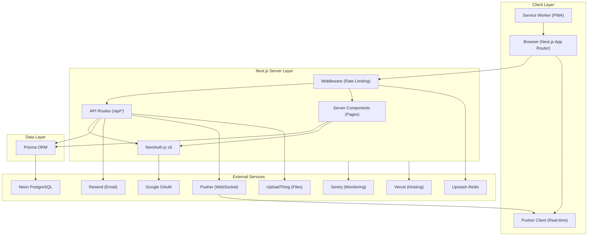

### 1.2 Request Lifecycle

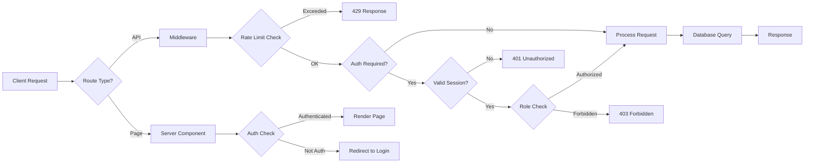

---

## 2. Authentication Flows

### 2.1 Credentials Login Flow

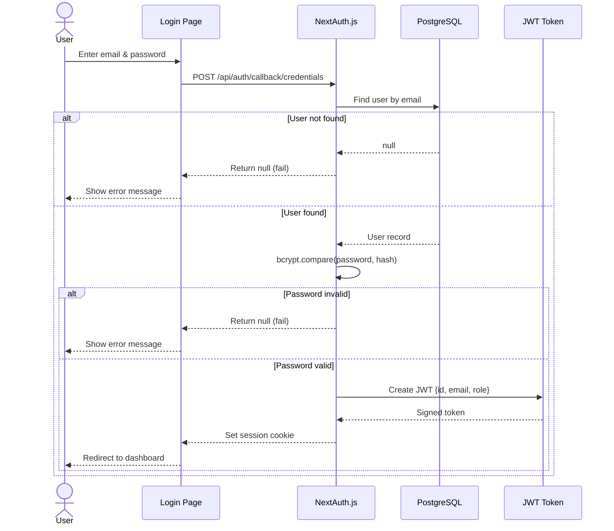

### 2.2 Google OAuth Login Flow

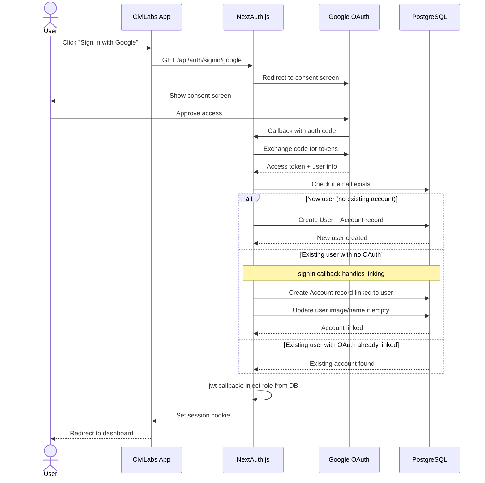

### 2.3 Registration Flow

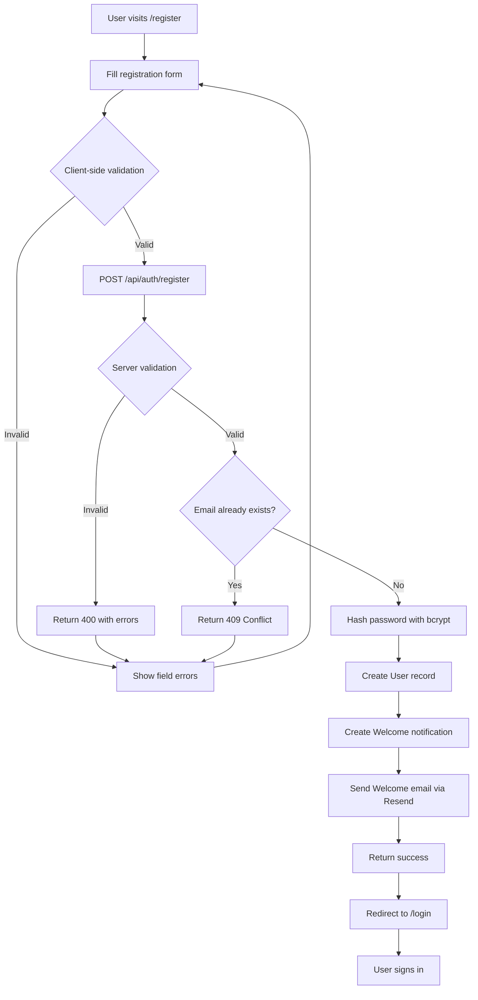

### 2.4 Session Management State Diagram

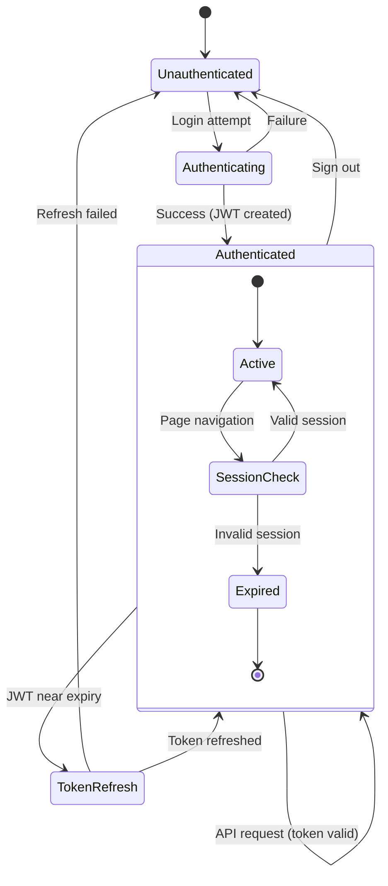

---

## 3. User Journey Flows

### 3.1 Student Complete Journey

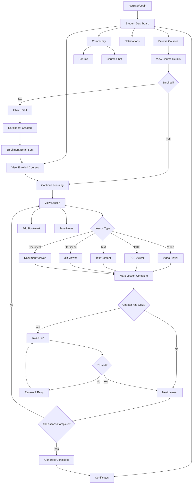

### 3.2 Instructor Complete Journey

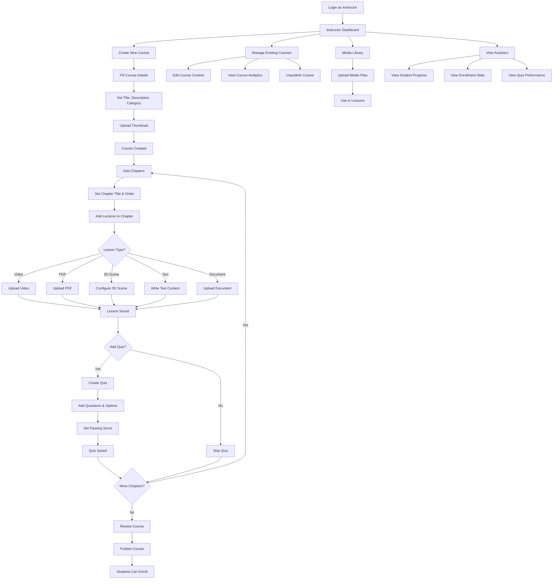

### 3.3 Admin Complete Journey

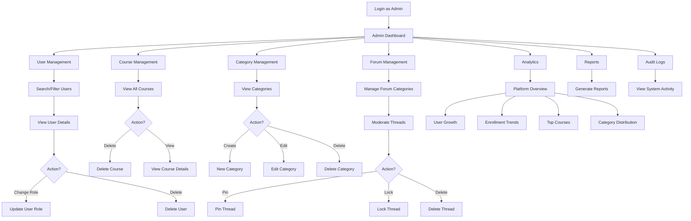

---

## 4. Course Management Flows

### 4.1 Course Creation & Publishing

```mermaid
flowchart TD
    A[Instructor: Create Course] --> B[POST /api/courses]

    B --> C{Validate Input}
    C -->|Invalid| D[Return 400]
    C -->|Valid| E[Generate Slug]

    E --> F[Create Course Record]
    F --> G[Create ChatRoom for Course]
    G --> H[Return Course Object]

    H --> I[Instructor Adds Content]
    I --> J[Add Chapters]
    J --> K[Add Lessons]
    K --> L[Add Quizzes]

    L --> M{Ready to Publish?}
    M -->|No| I
    M -->|Yes| N[POST /api/courses/{id}/publish]

    N --> O{Validation}
    O -->|Has chapters?| P{Has lessons?}
    O -->|No chapters| Q[Return Error]
    P -->|Yes| R[Set isPublished = true]
    P -->|No lessons| Q

    R --> S[Notify Enrolled Students]
    S --> T[Course Live]
```

### 4.2 Course Content Structure

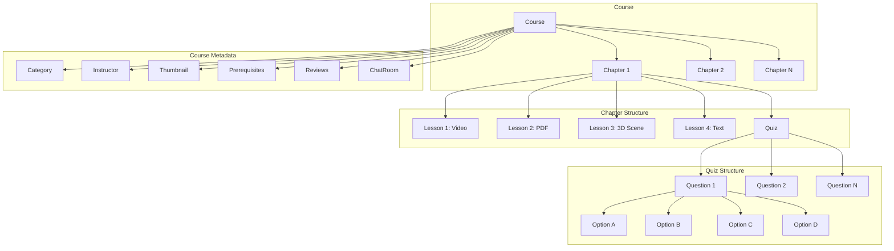

### 4.3 Course State Diagram

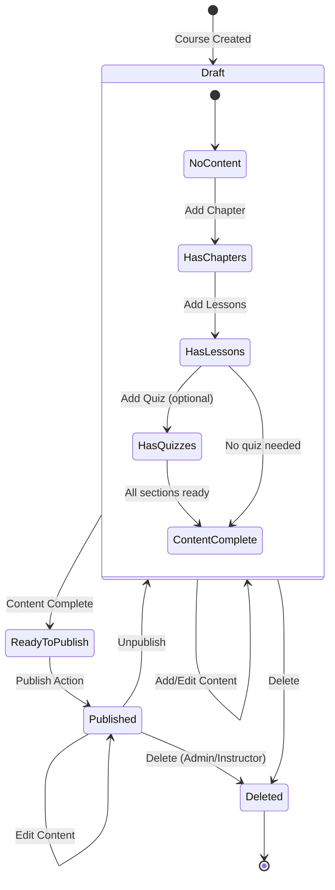

---

## 5. Learning & Progress Flows

### 5.1 Lesson Viewing & Progress Tracking

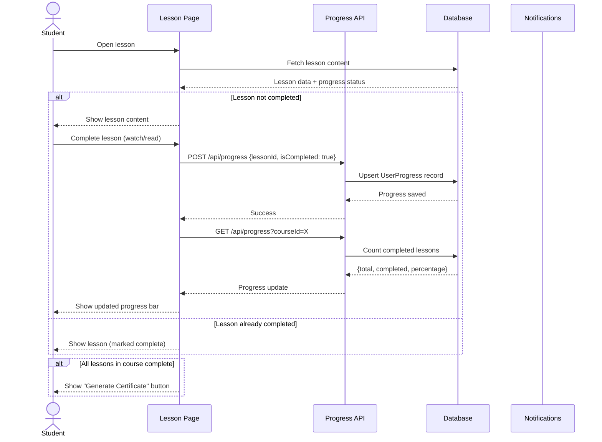

### 5.2 Course Progress State

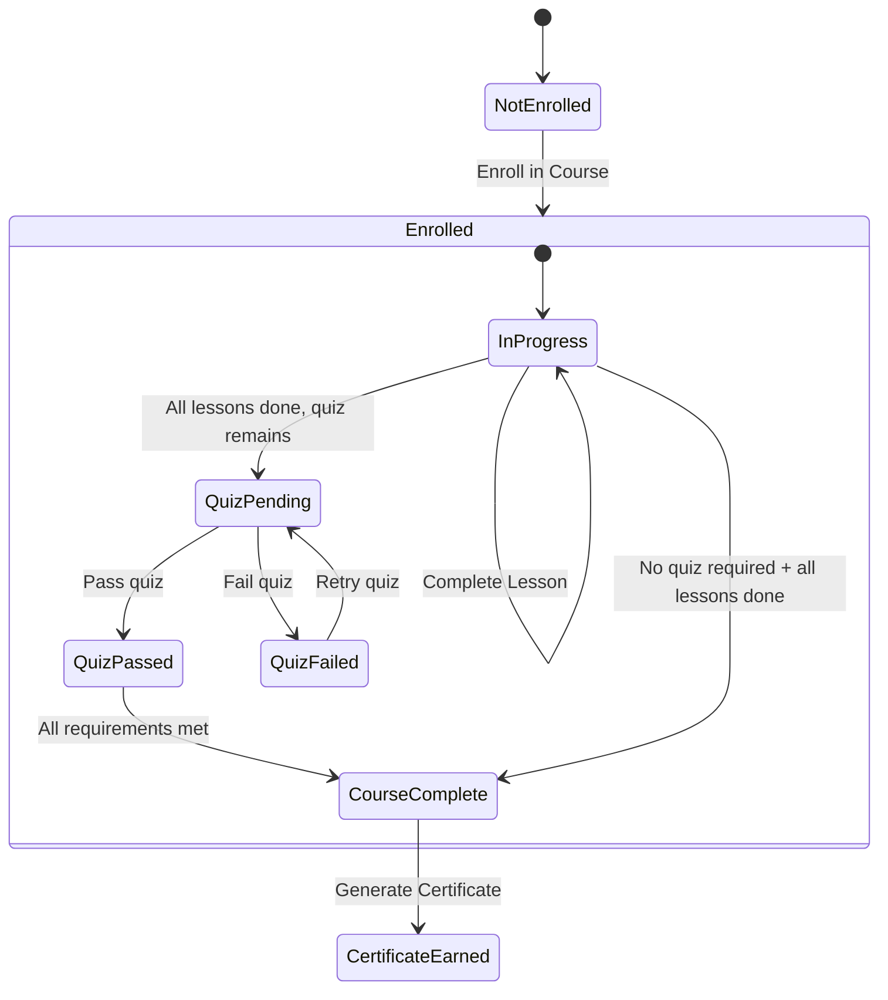

### 5.3 Enrollment Flow

```mermaid
flowchart TD
    A[Student views Course] --> B{Already enrolled?}
    B -->|Yes| C[Show "Continue Learning"]
    B -->|No| D[Show "Enroll" button]

    D --> E[Click Enroll]
    E --> F[POST /api/enrollments]

    F --> G{Course published?}
    G -->|No| H[Return 404]
    G -->|Yes| I{Already enrolled?}
    I -->|Yes| J[Return 409 Conflict]
    I -->|No| K[Create Enrollment]

    K --> L[Send Enrollment Email]
    L --> M[Create Notification for Instructor]
    M --> N[Return Enrollment Object]
    N --> O[Redirect to Course Learning Page]
```

---

## 6. Quiz & Assessment Flows

### 6.1 Quiz Attempt Flow

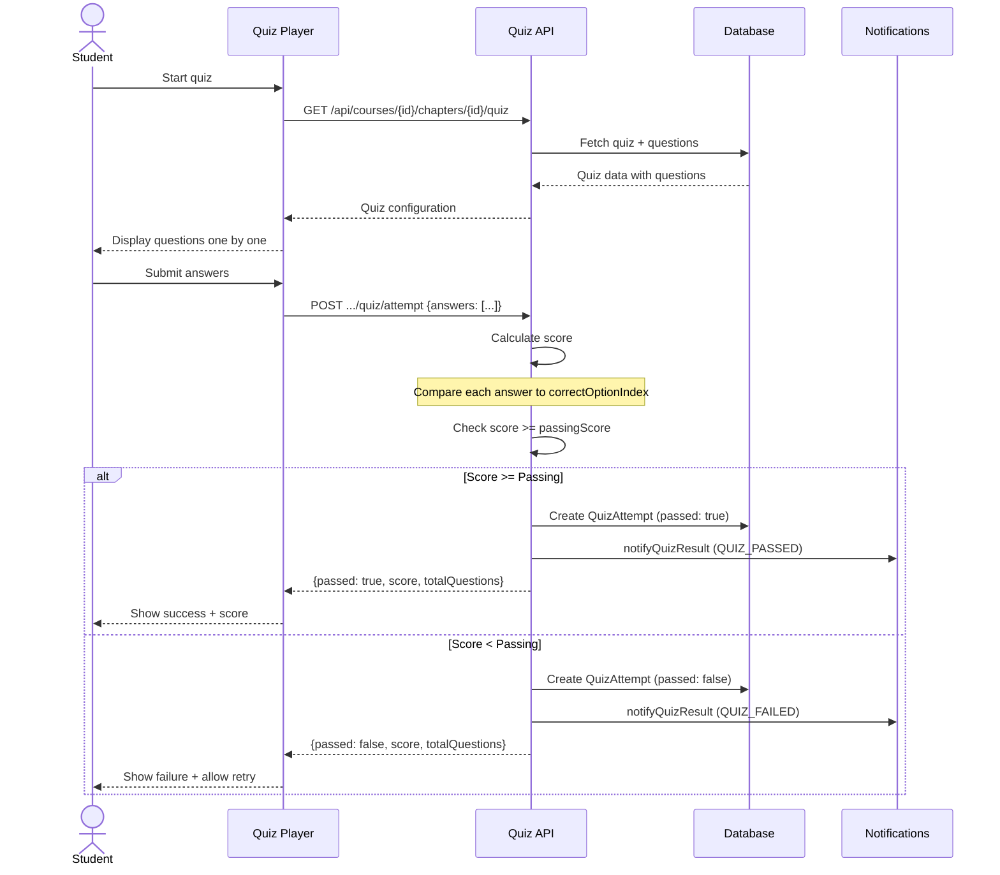

### 6.2 Quiz Builder Flow (Instructor)

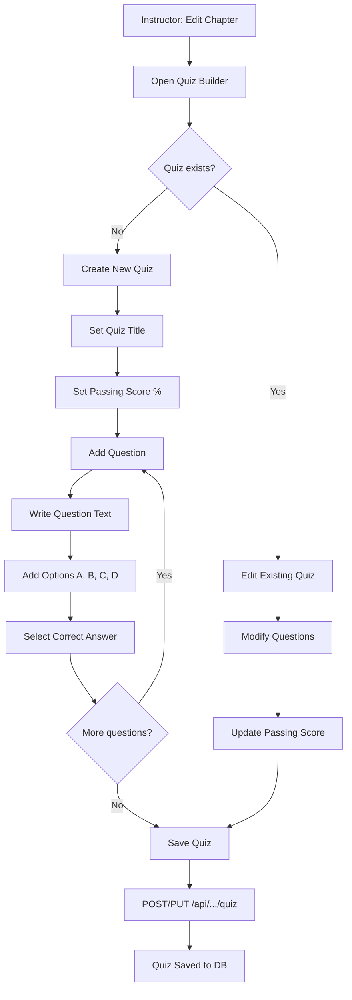

---

## 7. Certificate Flows

### 7.1 Certificate Generation

```mermaid
flowchart TD
    A[Student: All lessons complete] --> B[Click "Generate Certificate"]
    B --> C[POST /api/certificates]

    C --> D{Validation Checks}
    D --> E{User enrolled?}
    E -->|No| F[Return 403]
    E -->|Yes| G{All lessons completed?}
    G -->|No| H[Return 400: Incomplete]
    G -->|Yes| I{All quizzes passed?}
    I -->|No| J[Return 400: Quiz not passed]
    I -->|Yes| K{Certificate exists?}
    K -->|Yes| L[Return existing certificate]
    K -->|No| M[Generate unique code]

    M --> N[Create Certificate record]
    N --> O[Update Enrollment completedAt]
    O --> P[Create CERTIFICATE_EARNED notification]
    P --> Q[Send certificate email via Resend]
    Q --> R[Return certificate data]
    R --> S[Show certificate to student]
```

### 7.2 Certificate Verification

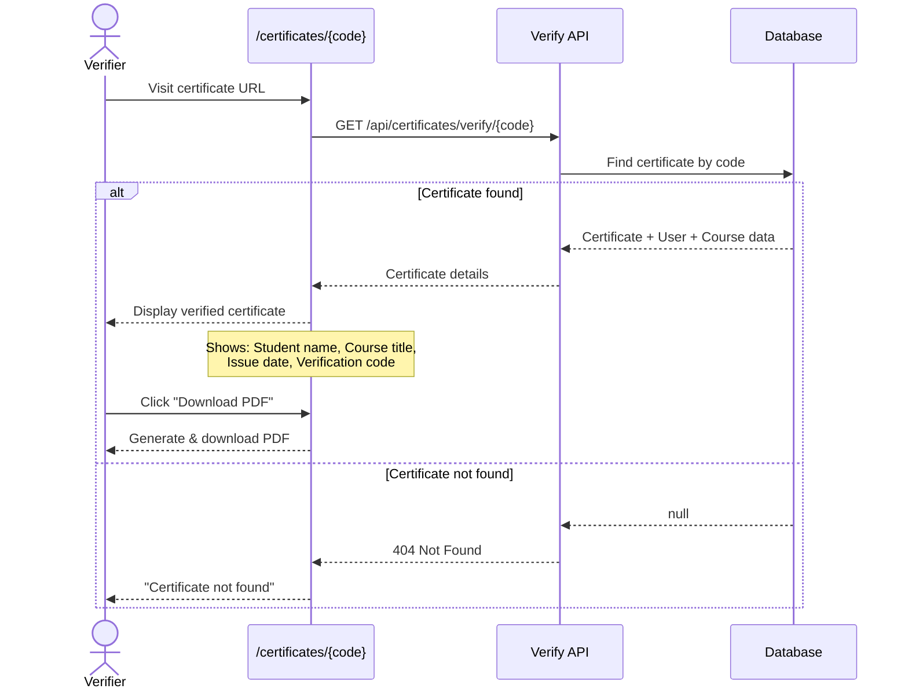

---

## 8. Community Flows (Forums & Chat)

### 8.1 Forum Thread Lifecycle

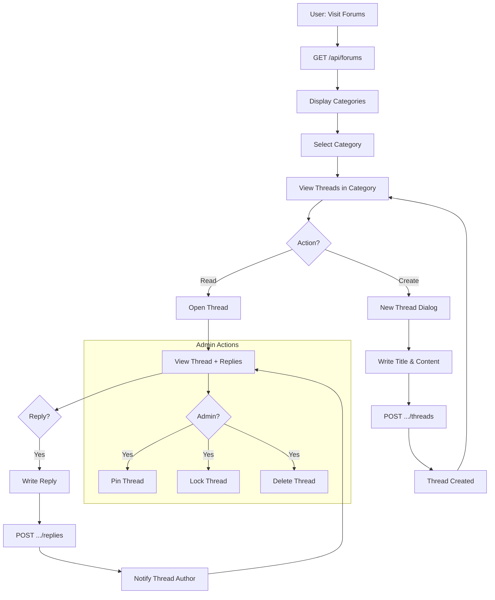

### 8.2 Real-Time Chat Flow

```mermaid
sequenceDiagram
    actor Student
    participant ChatUI as Chat Component
    participant API as Chat API
    participant Pusher as Pusher Server
    participant DB as Database
    actor OtherStudents as Other Students

    Student->>ChatUI: Open course chat room
    ChatUI->>API: GET /api/chat/{roomId}/messages
    API->>DB: Fetch recent messages
    DB-->>API: Message history
    API-->>ChatUI: Display messages

    ChatUI->>Pusher: Subscribe to channel
    Note over ChatUI,Pusher: pusher-js client connects

    Student->>ChatUI: Type message
    ChatUI->>API: POST /api/chat/{roomId}/messages
    API->>DB: Save message
    API->>Pusher: Trigger 'new-message' event
    Pusher-->>ChatUI: Receive own message
    Pusher-->>OtherStudents: Broadcast message

    OtherStudents->>OtherStudents: Display new message in UI
```

### 8.3 Chat Room State

```mermaid
stateDiagram-v2
    [*] --> Disconnected

    Disconnected --> Connecting : Open chat room
    Connecting --> Connected : Pusher authenticated
    Connecting --> Error : Auth failed

    Connected --> Receiving : New message event
    Receiving --> Connected : Message displayed

    Connected --> Sending : User sends message
    Sending --> Connected : Message saved & broadcast
    Sending --> Error : Send failed

    Connected --> Disconnected : Leave room
    Error --> Connecting : Retry
```

---

## 9. Admin Flows

### 9.1 User Management Flow

```mermaid
flowchart TD
    A[Admin Dashboard] --> B[User Management]
    B --> C[GET /api/admin/users]
    C --> D[Display User List]

    D --> E{Search/Filter}
    E --> F[Filter by Role]
    E --> G[Search by Name/Email]
    F & G --> C

    D --> H[Select User]
    H --> I[View User Details]
    I --> J{Action?}

    J -->|Change Role| K[Select New Role]
    K --> L[PUT /api/admin/users/{id}]
    L --> M[Role Updated]
    M --> N[Audit Log Created]

    J -->|Delete User| O[Confirm Deletion]
    O --> P[DELETE /api/admin/users/{id}]
    P --> Q[User + Related Data Deleted]
    Q --> N

    J -->|View Details| R[Show Enrollments]
    R --> S[Show Certificates]
    S --> T[Show Activity]
```

### 9.2 Platform Analytics Flow

```mermaid
flowchart TD
    A[Admin: Analytics Page] --> B[GET /api/admin/analytics]

    B --> C{Query Type}
    C -->|overview| D[Platform Metrics]
    C -->|trends| E[Enrollment Trends]
    C -->|top-courses| F[Top Courses]
    C -->|categories| G[Category Distribution]

    D --> H[Total Users]
    D --> I[Total Courses]
    D --> J[Total Enrollments]
    D --> K[Completion Rate]
    D --> L[Active Users 30d]

    E --> M[Daily Enrollments Chart]
    F --> N[Courses by Enrollment Count]
    G --> O[Category Pie Chart]

    H & I & J & K & L & M & N & O --> P[Render Dashboard]
```

---

## 10. API Sequence Diagrams

### 10.1 Course Enrollment Sequence

```mermaid
sequenceDiagram
    actor Student
    participant UI as Course Page
    participant API as Enrollment API
    participant Auth as Auth Middleware
    participant DB as Database
    participant Email as Resend
    participant Notify as Notifications

    Student->>UI: Click "Enroll"
    UI->>API: POST /api/enrollments {courseId}
    API->>Auth: Verify session
    Auth-->>API: {userId, role: STUDENT}

    API->>DB: Check course exists & published
    DB-->>API: Course data

    API->>DB: Check existing enrollment
    DB-->>API: No existing enrollment

    API->>DB: Create Enrollment record
    DB-->>API: Enrollment created

    par Send notifications
        API->>Email: sendEnrollmentEmail(student, course)
        API->>Notify: notifyEnrollment(instructor, student, course)
    end

    API-->>UI: 201 {enrollment}
    UI-->>Student: "Successfully enrolled!"
```

### 10.2 Lesson Content Delivery Sequence

```mermaid
sequenceDiagram
    actor Student
    participant UI as Lesson Viewer
    participant API as Lesson API
    participant DB as Database
    participant CDN as UploadThing CDN

    Student->>UI: Navigate to lesson
    UI->>API: GET /api/courses/{id}/chapters/{id}/lessons/{id}
    API->>DB: Fetch lesson with enrollment check
    DB-->>API: Lesson data

    alt Video Lesson
        API-->>UI: {type: VIDEO, videoUrl}
        UI->>CDN: Stream video
        CDN-->>UI: Video stream
    else PDF Lesson
        API-->>UI: {type: PDF, attachmentUrl}
        UI->>CDN: Fetch PDF
        CDN-->>UI: PDF document
    else 3D Scene
        API-->>UI: {type: SCENE_3D, sceneConfig}
        UI->>UI: Initialize Three.js scene
        UI->>CDN: Load 3D models from URLs
        CDN-->>UI: GLB/GLTF models
    else Text Lesson
        API-->>UI: {type: TEXT, content}
        UI-->>Student: Render markdown/HTML
    end

    Student->>UI: Mark as complete
    UI->>API: POST /api/progress
    API->>DB: Upsert UserProgress
    DB-->>API: Saved
    API-->>UI: {completed: true}
```

### 10.3 Rate Limiting Sequence

```mermaid
sequenceDiagram
    actor Client
    participant MW as Middleware
    participant Redis as Upstash Redis
    participant API as API Route

    Client->>MW: API Request
    MW->>MW: Extract IP (x-forwarded-for / x-real-ip)
    MW->>MW: Determine limiter (auth vs general)

    MW->>Redis: ratelimit.limit(ip)

    alt Rate limit OK
        Redis-->>MW: {success: true, remaining: 95}
        MW->>API: Forward request
        API-->>MW: Response
        MW->>MW: Add X-RateLimit headers
        MW-->>Client: Response with headers
    else Rate limit exceeded
        Redis-->>MW: {success: false, reset: timestamp}
        MW-->>Client: 429 Too Many Requests
        Note over Client: Retry-After header included
    end
```

---

## 11. Data Flow Diagrams

### 11.1 Complete Data Flow

```mermaid
flowchart TD
    subgraph Input["Data Input Sources"]
        A1[User Registration Form]
        A2[Course Creation Form]
        A3[Lesson Content Upload]
        A4[Quiz Answers]
        A5[Chat Messages]
        A6[Forum Posts]
    end

    subgraph Validation["Validation Layer"]
        B1[Zod Schema Validation]
        B2[Auth Session Check]
        B3[Role Permission Check]
    end

    subgraph Processing["Processing Layer"]
        C1[Password Hashing - bcrypt]
        C2[Slug Generation]
        C3[Score Calculation]
        C4[Certificate Code Gen]
        C5[File Upload Processing]
    end

    subgraph Storage["Data Storage"]
        D1[(PostgreSQL - Neon)]
        D2[(Redis - Upstash)]
        D3[(UploadThing - Files)]
    end

    subgraph Output["Data Output"]
        E1[Server-rendered Pages]
        E2[API JSON Responses]
        E3[Email Notifications]
        E4[Real-time Events]
        E5[PDF Certificates]
    end

    A1 & A2 & A3 & A4 & A5 & A6 --> B1
    B1 --> B2
    B2 --> B3
    B3 --> C1 & C2 & C3 & C4 & C5
    C1 & C2 & C3 & C4 --> D1
    C5 --> D3
    D2 --> B3
    D1 --> E1 & E2
    D3 --> E1
    D1 --> E3
    D1 --> E4
    D1 --> E5
```

### 11.2 Database Relationship Map

```mermaid
erDiagram
    User ||--o{ Account : "has OAuth"
    User ||--o{ Enrollment : "enrolls in"
    User ||--o{ Course : "teaches"
    User ||--o{ UserProgress : "tracks"
    User ||--o{ QuizAttempt : "attempts"
    User ||--o{ Certificate : "earns"
    User ||--o{ Notification : "receives"
    User ||--o{ Bookmark : "saves"
    User ||--o{ Note : "writes"
    User ||--o{ CourseReview : "reviews"
    User ||--o{ ForumThread : "creates"
    User ||--o{ ForumReply : "posts"
    User ||--o{ Message : "sends"
    User ||--o{ Media : "uploads"
    User ||--o{ AuditLog : "generates"

    Course ||--o{ Chapter : "contains"
    Course ||--o{ Enrollment : "has"
    Course ||--o{ CourseReview : "receives"
    Course ||--o{ ChatRoom : "has"
    Course }o--|| Category : "belongs to"
    Course ||--o{ CoursePrerequisite : "requires"

    Chapter ||--o{ Lesson : "contains"
    Chapter ||--o| Quiz : "has"

    Quiz ||--o{ Question : "contains"
    Quiz ||--o{ QuizAttempt : "receives"

    Lesson ||--o{ UserProgress : "tracked by"
    Lesson ||--o{ Bookmark : "bookmarked in"
    Lesson ||--o{ Note : "noted in"

    ChatRoom ||--o{ Message : "contains"

    ForumCategory ||--o{ ForumThread : "contains"
    ForumThread ||--o{ ForumReply : "has"

    LearningPath ||--o{ LearningPathCourse : "contains"
    LearningPath ||--o{ LearningPathEnrollment : "has"

    User {
        string id PK
        string email UK
        string name
        string password
        UserRole role
        string image
        string bio
        datetime emailVerified
    }

    Course {
        string id PK
        string title
        string slug UK
        string description
        string imageUrl
        boolean isPublished
        string instructorId FK
        string categoryId FK
    }

    Enrollment {
        string id PK
        string userId FK
        string courseId FK
        datetime completedAt
    }

    Certificate {
        string id PK
        string code UK
        string userId FK
        string courseId FK
        datetime issuedAt
    }
```

### 11.3 Email Notification Data Flow

```mermaid
flowchart LR
    subgraph Triggers["Email Triggers"]
        A[User Registers]
        B[Student Enrolls]
        C[Certificate Earned]
    end

    subgraph EmailService["Email Service (Resend)"]
        D[sendWelcomeEmail]
        E[sendEnrollmentEmail]
        F[sendCertificateEmail]
    end

    subgraph Templates["Email Content"]
        G[Welcome Message + Getting Started]
        H[Course Name + Start Learning Link]
        I[Certificate Link + Verification Code]
    end

    A --> D --> G
    B --> E --> H
    C --> F --> I

    G & H & I --> J[Resend API]
    J --> K[User Inbox]
```

---

## 12. Role-Based Access Control

### 12.1 RBAC Overview

```mermaid
flowchart TD
    subgraph Roles["User Roles"]
        Student[STUDENT]
        Instructor[INSTRUCTOR]
        Admin[ADMIN]
    end

    subgraph StudentAccess["Student Permissions"]
        S1[Browse Published Courses]
        S2[Enroll in Courses]
        S3[View Lessons]
        S4[Take Quizzes]
        S5[Track Progress]
        S6[Generate Certificates]
        S7[Post in Forums]
        S8[Use Course Chat]
        S9[Bookmarks & Notes]
        S10[Write Reviews]
    end

    subgraph InstructorAccess["Instructor Permissions"]
        I1[Create Courses]
        I2[Edit Own Courses]
        I3[Create Chapters & Lessons]
        I4[Create Quizzes]
        I5[Publish/Unpublish Courses]
        I6[Upload Media]
        I7[View Course Analytics]
        I8[Access Media Library]
    end

    subgraph AdminAccess["Admin Permissions"]
        A1[Manage All Users]
        A2[Change User Roles]
        A3[Delete Users/Courses]
        A4[Manage Categories]
        A5[Manage Forum Categories]
        A6[Moderate Forums]
        A7[View Platform Analytics]
        A8[Generate Reports]
        A9[View Audit Logs]
    end

    Student --> StudentAccess
    Instructor --> StudentAccess
    Instructor --> InstructorAccess
    Admin --> StudentAccess
    Admin --> InstructorAccess
    Admin --> AdminAccess
```

### 12.2 Route Protection Matrix

```mermaid
flowchart TD
    A[Incoming Request] --> B{Authenticated?}
    B -->|No| C{Public Route?}
    C -->|Yes| D[Allow Access]
    C -->|No| E[Redirect to /login]

    B -->|Yes| F{Route Type?}

    F -->|/student/*| G{Role = STUDENT?}
    G -->|Yes| D
    G -->|No| H{Role = INSTRUCTOR or ADMIN?}
    H -->|Yes| D
    H -->|No| I[Redirect to Dashboard]

    F -->|/instructor/*| J{Role = INSTRUCTOR?}
    J -->|Yes| D
    J -->|No| K{Role = ADMIN?}
    K -->|Yes| D
    K -->|No| I

    F -->|/admin/*| L{Role = ADMIN?}
    L -->|Yes| D
    L -->|No| I

    F -->|/courses, /forums, /chat| D
```

### 12.3 API Authorization Flow

```mermaid
sequenceDiagram
    actor User
    participant API as API Route
    participant Auth as auth()
    participant DB as Database

    User->>API: Request with session cookie
    API->>Auth: const session = await auth()

    alt No session
        Auth-->>API: null
        API-->>User: 401 Unauthorized
    else Has session
        Auth-->>API: {user: {id, email, role}}

        API->>API: Check role permissions

        alt Insufficient role
            API-->>User: 403 Forbidden
        else Authorized
            API->>DB: Execute query

            alt Resource ownership check
                API->>API: Verify user owns resource
                Note over API: e.g., instructor owns course
            end

            DB-->>API: Data
            API-->>User: 200 OK + Data
        end
    end
```

---

## 13. State Diagrams

### 13.1 Course Lifecycle States

```mermaid
stateDiagram-v2
    [*] --> Created : Instructor creates course

    Created --> HasChapters : Add chapters
    HasChapters --> HasContent : Add lessons/quizzes
    HasContent --> Published : Publish

    Published --> HasEnrollments : Students enroll
    HasEnrollments --> Active : Students learning
    Active --> Active : New enrollments

    Published --> Unpublished : Instructor unpublishes
    Unpublished --> Published : Re-publish

    Created --> Deleted : Delete (no enrollments)
    HasChapters --> Deleted : Delete
    HasContent --> Deleted : Delete
    Published --> Deleted : Admin force delete
    Deleted --> [*]
```

### 13.2 Student Enrollment Lifecycle

```mermaid
stateDiagram-v2
    [*] --> Browsing : Student views course catalog

    Browsing --> ViewingCourse : Select course
    ViewingCourse --> Browsing : Back to catalog
    ViewingCourse --> Enrolled : Click Enroll

    Enrolled --> Learning : Start first lesson

    state Learning {
        [*] --> ViewingLesson
        ViewingLesson --> LessonCompleted : Mark complete
        LessonCompleted --> ViewingLesson : Next lesson
        LessonCompleted --> TakingQuiz : Chapter quiz available
        TakingQuiz --> QuizPassed : Score >= passing
        TakingQuiz --> QuizFailed : Score < passing
        QuizFailed --> TakingQuiz : Retry
        QuizPassed --> ViewingLesson : Next chapter
        QuizPassed --> AllComplete : Last chapter done
    }

    AllComplete --> Certified : Generate certificate
    Certified --> [*]
```

### 13.3 Notification States

```mermaid
stateDiagram-v2
    [*] --> Created : Event triggers notification

    Created --> Unread : Stored in DB
    Unread --> Read : User clicks notification
    Read --> [*]

    state "Notification Types" as Types {
        [*] --> WELCOME
        [*] --> ENROLLMENT
        [*] --> COURSE_PUBLISHED
        [*] --> CERTIFICATE_EARNED
        [*] --> QUIZ_PASSED
        [*] --> QUIZ_FAILED
        [*] --> FORUM_REPLY
        [*] --> COURSE_UPDATE
        [*] --> ANNOUNCEMENT
    }
```

### 13.4 Quiz Attempt States

```mermaid
stateDiagram-v2
    [*] --> NotAttempted

    NotAttempted --> InProgress : Start quiz

    state InProgress {
        [*] --> Question1
        Question1 --> Question2 : Answer
        Question2 --> QuestionN : Answer
        QuestionN --> Submitted : Submit all
    }

    Submitted --> Scoring : Calculate score
    Scoring --> Passed : score >= passingScore
    Scoring --> Failed : score < passingScore

    Failed --> InProgress : Retry
    Passed --> [*] : Quiz complete

    state "Attempt Record" as Record {
        Score : Numeric score
        Answers : JSON answer array
        Timestamp : Attempt time
    }
```

---

## 14. 3D Scene Flows

### 14.1 3D Scene Creation Flow

```mermaid
flowchart TD
    A[Instructor: Create 3D Lesson] --> B[Open Scene Editor]

    B --> C[Configure Camera]
    C --> D{Camera Type}
    D -->|Perspective| E[Set FOV, Near, Far]
    D -->|Orthographic| F[Set Zoom, Near, Far]

    E & F --> G[Configure Controls]
    G --> H{Control Type}
    H -->|Orbit| I[Set target, speeds, limits]
    H -->|Fly| J[Set speed, dampening]
    H -->|First Person| K[Set height, speed]

    I & J & K --> L[Configure Environment]
    L --> M[Set Background/Preset]
    M --> N[Configure Fog/Ground]

    N --> O[Add Scene Objects]
    O --> P{Object Type}
    P -->|3D Model| Q[Upload GLB/GLTF/OBJ/FBX]
    P -->|Primitive| R[Select Shape]
    P -->|Light| S[Configure Light]
    P -->|Annotation| T[Add Hotspot]

    Q --> U[Set Transform: position, rotation, scale]
    R --> V[Set Material: color, metalness, roughness]
    S --> W[Set intensity, color, shadows]
    T --> X[Set label, description, camera position]

    U & V & W & X --> Y{More objects?}
    Y -->|Yes| O
    Y -->|No| Z[Save SceneConfig as JSON]
    Z --> AA[Lesson Saved]
```

### 14.2 3D Scene Rendering Flow

```mermaid
flowchart TD
    A[Student Opens 3D Lesson] --> B[Load SceneConfig JSON]
    B --> C[Initialize Three.js Canvas]

    C --> D[Setup Camera]
    D --> E[Setup Controls]
    E --> F[Setup Environment]

    F --> G[Load Scene Objects]
    G --> H{For each object}

    H -->|Model| I[ModelLoader: fetch GLB/GLTF]
    H -->|Primitive| J[PrimitiveObject: create geometry]
    H -->|Light| K[SceneLights: create light]
    H -->|Annotation| L[Annotations: create hotspot]

    I --> M[Apply transforms]
    J --> N[Apply materials]
    K --> O[Apply shadow settings]
    L --> P[Position in 3D space]

    M & N & O & P --> Q[Render Loop]
    Q --> R[User Interaction]
    R --> S{Action}
    S -->|Orbit/Pan/Zoom| T[Update camera]
    S -->|Click Annotation| U[Animate to position]
    S -->|Click Object| V[Show info panel]
    T & U & V --> Q
```

### 14.3 3D Object Hierarchy

```mermaid
graph TD
    subgraph SceneConfig
        A[Scene Root]
        A --> B[Camera Config]
        A --> C[Controls Config]
        A --> D[Environment Config]
        A --> E[Objects Array]
    end

    subgraph Objects
        E --> F[Object 1: Model]
        E --> G[Object 2: Primitive]
        E --> H[Object 3: Light]
        E --> I[Object 4: Annotation]
        E --> J[Object 5: Group]
        J --> K[Child Object 1]
        J --> L[Child Object 2]
    end

    subgraph ObjectProperties
        F --> M[Transform]
        F --> N[ModelConfig: url, format, animations]
        G --> O[Transform]
        G --> P[PrimitiveConfig: type, dimensions]
        G --> Q[Material: color, metalness, roughness]
        H --> R[LightConfig: type, intensity, shadows]
        I --> S[AnnotationConfig: label, cameraPosition]
    end
```

---

## 15. Notification System

### 15.1 Notification Trigger Map

```mermaid
flowchart TD
    subgraph Events["Trigger Events"]
        E1[User Registers]
        E2[Student Enrolls]
        E3[Course Published]
        E4[Quiz Passed]
        E5[Quiz Failed]
        E6[Certificate Earned]
        E7[Forum Reply]
        E8[Course Updated]
        E9[Admin Announcement]
    end

    subgraph NotifyService["Notification Service"]
        N1[notifyWelcome]
        N2[notifyEnrollment]
        N3[notifyCoursePublished]
        N4[notifyQuizResult - Pass]
        N5[notifyQuizResult - Fail]
        N6[notifyCertificateEarned]
        N7[notifyForumReply]
        N8[notifyCourseUpdate]
        N9[notifyAnnouncement]
    end

    subgraph Recipients["Recipients"]
        R1[New User]
        R2[Course Instructor]
        R3[Enrolled Students]
        R4[Quiz Taker]
        R5[Certificate Earner]
        R6[Thread Author]
        R7[All Users]
    end

    E1 --> N1 --> R1
    E2 --> N2 --> R2
    E3 --> N3 --> R3
    E4 --> N4 --> R4
    E5 --> N5 --> R4
    E6 --> N6 --> R5
    E7 --> N7 --> R6
    E8 --> N8 --> R3
    E9 --> N9 --> R7
```

### 15.2 Notification Delivery Flow

```mermaid
sequenceDiagram
    participant Event as System Event
    participant Service as Notification Service
    participant DB as Database
    participant Bell as Notification Bell
    participant User as User

    Event->>Service: Trigger notification
    Service->>DB: Create Notification record
    Note over DB: {type, title, message, link, userId, isRead: false}
    DB-->>Service: Notification created

    User->>Bell: View notification count
    Bell->>DB: getUnreadCount(userId)
    DB-->>Bell: count: 3
    Bell-->>User: Show badge "3"

    User->>Bell: Click bell icon
    Bell->>DB: GET /api/notifications
    DB-->>Bell: Notification list
    Bell-->>User: Display notifications

    User->>Bell: Click notification
    Bell->>DB: POST /api/notifications/{id} (mark read)
    DB-->>Bell: Updated
    Bell-->>User: Navigate to link
```

---

## 16. Media & Upload Flows

### 16.1 File Upload Flow

```mermaid
flowchart TD
    A[User: Select File] --> B{File Type?}

    B -->|Image| C[Image Upload Component]
    B -->|Video| D[Video Upload Component]
    B -->|Document| E[File Upload Component]
    B -->|3D Model| F[Model Upload Component]

    C & D & E & F --> G[UploadThing Client]
    G --> H[POST /api/uploadthing]
    H --> I[UploadThing Server]
    I --> J{Validate}
    J -->|Size OK| K{Type OK}
    J -->|Too large| L[Return Error]
    K -->|Valid| M[Upload to CDN]
    K -->|Invalid type| L

    M --> N[Return URL]
    N --> O[Save URL to Database]
    O --> P{Context?}
    P -->|Course thumbnail| Q[Update Course.imageUrl]
    P -->|Lesson video| R[Update Lesson.videoUrl]
    P -->|Lesson attachment| S[Update Lesson.attachmentUrl]
    P -->|3D Model| T[Store in SceneConfig]
    P -->|Media library| U[Create Media record]
```

### 16.2 Media Library Flow

```mermaid
flowchart TD
    A[Instructor: Media Library] --> B[GET /api/media]
    B --> C[Display Media Grid]

    C --> D{Action?}
    D -->|Upload| E[Select File]
    E --> F[Upload via UploadThing]
    F --> G[POST /api/media]
    G --> H[Create Media Record]
    H --> C

    D -->|Delete| I[Confirm Delete]
    I --> J[DELETE /api/media/{id}]
    J --> K[Remove from DB]
    K --> C

    D -->|Use in Lesson| L[Copy URL]
    L --> M[Paste in Lesson Editor]

    subgraph MediaTypes["Supported Types"]
        T1[IMAGE: jpg, png, gif, webp]
        T2[VIDEO: mp4, webm, mov]
        T3[DOCUMENT: pdf, doc, ppt]
        T4[MODEL_3D: glb, gltf, obj, fbx]
        T5[OTHER: zip, etc.]
    end
```

---

## Appendix: Technology Stack

```mermaid
graph LR
    subgraph Frontend
        Next["Next.js 14 (App Router)"]
        React["React 18"]
        TW["Tailwind CSS"]
        Shadcn["shadcn/ui"]
        Three["Three.js / R3F"]
        Pusher_JS["Pusher.js"]
    end

    subgraph Backend
        NextAPI["Next.js API Routes"]
        NextAuth["NextAuth.js v5"]
        Prisma_ORM["Prisma ORM"]
        Zod["Zod Validation"]
        Bcrypt["bcryptjs"]
    end

    subgraph Infrastructure
        Vercel_Host["Vercel (Hosting)"]
        Neon_DB["Neon (PostgreSQL)"]
        Upstash_Redis["Upstash (Redis)"]
        Pusher_Srv["Pusher (WebSocket)"]
        Resend_Email["Resend (Email)"]
        UT["UploadThing (Files)"]
        Sentry_Mon["Sentry (Monitoring)"]
    end

    Frontend --> Backend
    Backend --> Infrastructure
```

---

> **Note:** All diagrams use Mermaid syntax and render natively in GitHub, VS Code (with Mermaid extension), and most modern markdown viewers.
