# CiviLabs LMS - Role-Based Entity Relationship Diagrams

> Comprehensive ERD documentation organized by user role. For definitions and context, see [ERD_ROLE_DEFINITIONS.md](./ERD_ROLE_DEFINITIONS.md).

---

## Table of Contents

1. [Student Data Model](#1-student-data-model)
2. [Instructor Data Model](#2-instructor-data-model)
3. [Admin Data Model](#3-admin-data-model)

---

## 1. Student Data Model

This section shows all entities that students directly interact with during their learning journey.

```mermaid
erDiagram
    User {
        string id PK
        string name
        string email UK
        datetime emailVerified
        string image
        string password
        string role
        string bio
        boolean profileVisibility
        boolean mfaEnabled
        datetime consentAcceptedAt
        datetime createdAt
        datetime updatedAt
    }

    Course {
        string id PK
        string title
        string slug UK
        string description
        string imageUrl
        boolean isPublished
        string instructorId FK
        string categoryId FK
        datetime createdAt
        datetime updatedAt
    }

    Chapter {
        string id PK
        string title
        string description
        int position
        boolean isPublished
        boolean isFree
        string courseId FK
        datetime availableFrom
        datetime availableUntil
        datetime createdAt
        datetime updatedAt
    }

    Lesson {
        string id PK
        string title
        string description
        string type
        string content
        string videoUrl
        string attachmentUrl
        json sceneConfig
        int position
        int duration
        string chapterId FK
        datetime availableFrom
        datetime availableUntil
        datetime createdAt
        datetime updatedAt
    }

    Enrollment {
        string id PK
        string userId FK
        string courseId FK
        datetime completedAt
        datetime createdAt
        datetime updatedAt
    }

    UserProgress {
        string id PK
        string userId FK
        string lessonId FK
        boolean isCompleted
        datetime completedAt
        datetime createdAt
        datetime updatedAt
    }

    Certificate {
        string id PK
        string uniqueCode UK
        string userId FK
        string courseId FK
        datetime issuedAt
        string pdfUrl
    }

    Quiz {
        string id PK
        string title
        string description
        int passingScore
        string chapterId FK
        string assessmentType
        int timeLimit
        int attemptLimit
        datetime availableFrom
        datetime availableUntil
        boolean shuffleQuestions
        boolean shuffleOptions
        string showAnswersAfter
        boolean isProctored
        string passwordProtected
        boolean honorCodeRequired
        int poolSize
        string questionBankId FK
        datetime createdAt
        datetime updatedAt
    }

    QuizAttempt {
        string id PK
        string userId FK
        string quizId FK
        int score
        boolean passed
        json answers
        datetime completedAt
        datetime startedAt
        int timeSpentSeconds
        boolean isLate
        boolean honorCodeAccepted
        string ipAddress
        json questionsServed
        int earnedPoints
        int totalPoints
        boolean needsManualGrading
        datetime manualGradedAt
        string manualGradedBy
    }

    Assignment {
        string id PK
        string title
        string description
        string type
        string courseId FK
        string chapterId FK
        datetime dueDate
        int points
        boolean isPublished
        int position
        string allowedFileTypes
        int maxFileSize
        int maxSubmissions
        string latePolicy
        int latePenaltyPercent
        datetime availableFrom
        datetime availableUntil
        string rubricId FK
        boolean isGroupAssignment
        datetime createdAt
        datetime updatedAt
    }

    AssignmentSubmission {
        string id PK
        string assignmentId FK
        string userId FK
        string status
        int submissionNumber
        string groupId FK
        string fileUrl
        string fileName
        int fileSize
        string textContent
        string urlLink
        float grade
        string feedback
        json rubricScores
        datetime gradedAt
        string gradedBy
        datetime submittedAt
        boolean isLate
        float latePenaltyApplied
        datetime createdAt
        datetime updatedAt
    }

    Bookmark {
        string id PK
        string userId FK
        string lessonId FK
        string note
        datetime createdAt
    }

    Note {
        string id PK
        string userId FK
        string lessonId FK
        string content
        int timestamp
        datetime createdAt
        datetime updatedAt
    }

    CourseReview {
        string id PK
        string userId FK
        string courseId FK
        int rating
        string title
        string content
        boolean isPublic
        datetime createdAt
        datetime updatedAt
    }

    ForumThread {
        string id PK
        string title
        string content
        string userId FK
        string categoryId FK
        boolean isPinned
        boolean isLocked
        int views
        datetime createdAt
        datetime updatedAt
    }

    ForumReply {
        string id PK
        string content
        string userId FK
        string threadId FK
        datetime createdAt
        datetime updatedAt
    }

    Message {
        string id PK
        string content
        string userId FK
        string roomId FK
        datetime createdAt
    }

    ChatRoom {
        string id PK
        string courseId FK
        datetime createdAt
    }

    Notification {
        string id PK
        string type
        string title
        string message
        boolean read
        string userId FK
        string link
        json metadata
        datetime createdAt
    }

    NotificationPreference {
        string id PK
        string userId FK
        boolean emailEnrollment
        boolean emailCourseUpdates
        boolean emailCertificates
        boolean emailQuizResults
        boolean emailForumReplies
        boolean emailAnnouncements
        boolean emailChatMentions
        datetime createdAt
        datetime updatedAt
    }

    CalendarEvent {
        string id PK
        string title
        string description
        datetime startDate
        datetime endDate
        boolean allDay
        string type
        string color
        string courseId FK
        string userId FK
        string referenceType
        string referenceId
        datetime createdAt
        datetime updatedAt
    }

    CalendarToken {
        string id PK
        string token UK
        string userId FK
        datetime createdAt
    }

    GroupMember {
        string id PK
        string groupId FK
        string userId FK
        string role
        datetime joinedAt
    }

    CourseGroup {
        string id PK
        string name
        string courseId FK
        int maxMembers
        string createdBy
        datetime createdAt
        datetime updatedAt
    }

    LearningPath {
        string id PK
        string title
        string slug UK
        string description
        string imageUrl
        boolean isPublished
        int position
        datetime createdAt
        datetime updatedAt
    }

    LearningPathEnrollment {
        string id PK
        string userId FK
        string learningPathId FK
        datetime startedAt
        datetime completedAt
    }

    ConsentRecord {
        string id PK
        string userId FK
        string consentType
        boolean granted
        datetime grantedAt
        datetime revokedAt
        string ipAddress
        datetime createdAt
        datetime updatedAt
    }

    %% Core Learning Relationships
    User ||--o{ Enrollment : "enrolls in"
    User ||--o{ UserProgress : "tracks"
    User ||--o{ Certificate : "earns"
    User ||--o{ QuizAttempt : "attempts"
    User ||--o{ AssignmentSubmission : "submits"

    Course ||--o{ Enrollment : "has"
    Course ||--o{ Certificate : "awards"
    Course ||--o{ Chapter : "contains"
    Course ||--|| ChatRoom : "has"

    Chapter ||--o{ Lesson : "contains"
    Chapter ||--o| Quiz : "has"

    Lesson ||--o{ UserProgress : "tracked by"
    Lesson ||--o{ Bookmark : "bookmarked in"
    Lesson ||--o{ Note : "has notes"

    Quiz ||--o{ QuizAttempt : "has"

    Assignment ||--o{ AssignmentSubmission : "receives"

    %% Personal Features
    User ||--o{ Bookmark : "creates"
    User ||--o{ Note : "writes"
    User ||--o{ CourseReview : "writes"
    Course ||--o{ CourseReview : "has"

    %% Community
    User ||--o{ ForumThread : "creates"
    User ||--o{ ForumReply : "writes"
    User ||--o{ Message : "sends"
    ForumThread ||--o{ ForumReply : "has"
    ChatRoom ||--o{ Message : "contains"

    %% Notifications & Settings
    User ||--o{ Notification : "receives"
    User ||--o| NotificationPreference : "has"
    User ||--o{ ConsentRecord : "grants"

    %% Calendar & Groups
    User ||--o{ CalendarEvent : "has"
    User ||--o| CalendarToken : "has"
    User ||--o{ GroupMember : "joins"
    Course ||--o{ CalendarEvent : "has"
    Course ||--o{ CourseGroup : "has"
    CourseGroup ||--o{ GroupMember : "has"
    CourseGroup ||--o{ AssignmentSubmission : "submits"

    %% Learning Paths
    User ||--o{ LearningPathEnrollment : "enrolls"
    LearningPath ||--o{ LearningPathEnrollment : "has"
```

---

## 2. Instructor Data Model

This section shows all entities that instructors create, manage, and monitor.

```mermaid
erDiagram
    User {
        string id PK
        string name
        string email UK
        datetime emailVerified
        string image
        string password
        string role
        string bio
        boolean profileVisibility
        boolean mfaEnabled
        datetime createdAt
        datetime updatedAt
    }

    Course {
        string id PK
        string title
        string slug UK
        string description
        string imageUrl
        boolean isPublished
        boolean autoGradeSync
        string instructorId FK
        string categoryId FK
        datetime createdAt
        datetime updatedAt
    }

    Category {
        string id PK
        string name UK
        string slug UK
        datetime createdAt
        datetime updatedAt
    }

    Chapter {
        string id PK
        string title
        string description
        int position
        boolean isPublished
        boolean isFree
        string courseId FK
        datetime availableFrom
        datetime availableUntil
        datetime createdAt
        datetime updatedAt
    }

    Lesson {
        string id PK
        string title
        string description
        string type
        string content
        string videoUrl
        string attachmentUrl
        json sceneConfig
        int position
        int duration
        string chapterId FK
        datetime availableFrom
        datetime availableUntil
        datetime createdAt
        datetime updatedAt
    }

    Quiz {
        string id PK
        string title
        string description
        int passingScore
        string chapterId FK
        string assessmentType
        int timeLimit
        int attemptLimit
        datetime availableFrom
        datetime availableUntil
        boolean shuffleQuestions
        boolean shuffleOptions
        string showAnswersAfter
        boolean isProctored
        string passwordProtected
        json ipRestrictions
        boolean honorCodeRequired
        int lateGracePeriod
        string lateSubmissionPolicy
        int latePenaltyPercent
        int poolSize
        string questionBankId FK
        datetime createdAt
        datetime updatedAt
    }

    Question {
        string id PK
        string text
        string type
        json options
        int correctAnswer
        int points
        int position
        string quizId FK
        string explanation
        json acceptedAnswers
        json matchingPairs
        json orderingItems
        boolean correctBoolAnswer
        json blanks
        json multiSelectAnswers
        boolean partialCreditEnabled
        int essayWordLimit
        string essayRubricId
        datetime createdAt
        datetime updatedAt
    }

    QuestionBank {
        string id PK
        string title
        string description
        string courseId FK
        datetime createdAt
        datetime updatedAt
    }

    QuestionBankItem {
        string id PK
        string questionBankId FK
        string questionId FK
        int position
        datetime createdAt
    }

    Assignment {
        string id PK
        string title
        string description
        string type
        string courseId FK
        string chapterId FK
        datetime dueDate
        int points
        boolean isPublished
        int position
        string allowedFileTypes
        int maxFileSize
        int maxSubmissions
        string latePolicy
        int latePenaltyPercent
        datetime availableFrom
        datetime availableUntil
        string rubricId FK
        boolean isGroupAssignment
        datetime createdAt
        datetime updatedAt
    }

    AssignmentSubmission {
        string id PK
        string assignmentId FK
        string userId FK
        string status
        int submissionNumber
        string groupId FK
        string fileUrl
        string fileName
        int fileSize
        string textContent
        string urlLink
        float grade
        string feedback
        json rubricScores
        datetime gradedAt
        string gradedBy
        datetime submittedAt
        boolean isLate
        float latePenaltyApplied
        datetime createdAt
        datetime updatedAt
    }

    SubmissionComment {
        string id PK
        string submissionId FK
        string authorId FK
        string content
        datetime createdAt
        datetime updatedAt
    }

    SubmissionAnnotation {
        string id PK
        string submissionId FK
        string authorId FK
        int startOffset
        int endOffset
        string content
        datetime createdAt
        datetime updatedAt
    }

    Rubric {
        string id PK
        string title
        string description
        string courseId FK
        boolean isTemplate
        string createdBy
        datetime createdAt
        datetime updatedAt
    }

    RubricCriterion {
        string id PK
        string rubricId FK
        string title
        string description
        int position
        int maxPoints
        json levels
        datetime createdAt
        datetime updatedAt
    }

    GradeCategory {
        string id PK
        string name
        float weight
        string courseId FK
        int position
        int dropLowest
        datetime createdAt
        datetime updatedAt
    }

    GradeItem {
        string id PK
        string categoryId FK
        string title
        float points
        string type
        string referenceId
        boolean isExtraCredit
        boolean isVisible
        datetime dueDate
        datetime createdAt
        datetime updatedAt
    }

    StudentGrade {
        string id PK
        string gradeItemId FK
        string userId FK
        float score
        string letterGrade
        float overrideScore
        string overrideBy
        string overrideReason
        datetime gradedAt
        datetime createdAt
        datetime updatedAt
    }

    GradingScale {
        string id PK
        string name
        string courseId FK
        boolean isDefault
        json levels
        datetime createdAt
        datetime updatedAt
    }

    ReleaseCondition {
        string id PK
        string targetType
        string targetId
        string courseId FK
        string conditionType
        json conditionValue
        string operator
        int position
        datetime createdAt
        datetime updatedAt
    }

    Announcement {
        string id PK
        string title
        string content
        string courseId FK
        string authorId FK
        boolean isPinned
        boolean isPublished
        datetime publishedAt
        datetime scheduledFor
        string attachmentUrl
        datetime createdAt
        datetime updatedAt
    }

    AttendanceSession {
        string id PK
        string courseId FK
        datetime date
        string title
        string type
        string notes
        string createdBy
        datetime createdAt
        datetime updatedAt
    }

    AttendanceRecord {
        string id PK
        string sessionId FK
        string userId FK
        string status
        string notes
        datetime markedAt
        string markedBy
        datetime createdAt
        datetime updatedAt
    }

    UserActivity {
        string id PK
        string userId FK
        string courseId FK
        string lessonId FK
        string eventType
        json metadata
        string sessionId
        datetime timestamp
    }

    Media {
        string id PK
        string name
        string url
        string type
        int size
        string mimeType
        string userId FK
        string courseId FK
        datetime createdAt
        datetime updatedAt
    }

    CourseGroup {
        string id PK
        string name
        string courseId FK
        int maxMembers
        string createdBy
        datetime createdAt
        datetime updatedAt
    }

    GroupMember {
        string id PK
        string groupId FK
        string userId FK
        string role
        datetime joinedAt
    }

    ChatRoom {
        string id PK
        string courseId FK
        datetime createdAt
    }

    CalendarEvent {
        string id PK
        string title
        string description
        datetime startDate
        datetime endDate
        boolean allDay
        string type
        string color
        string courseId FK
        string userId FK
        string referenceType
        string referenceId
        datetime createdAt
        datetime updatedAt
    }

    Enrollment {
        string id PK
        string userId FK
        string courseId FK
        datetime completedAt
        datetime createdAt
        datetime updatedAt
    }

    QuizAttempt {
        string id PK
        string userId FK
        string quizId FK
        int score
        boolean passed
        json answers
        datetime completedAt
        boolean needsManualGrading
        datetime manualGradedAt
        string manualGradedBy
    }

    %% Course Structure
    User ||--o{ Course : "teaches"
    Course }o--o| Category : "belongs to"
    Course ||--o{ Chapter : "contains"
    Chapter ||--o{ Lesson : "contains"

    %% Assessments
    Chapter ||--o| Quiz : "has"
    Quiz ||--o{ Question : "contains"
    Course ||--o{ QuestionBank : "has"
    QuestionBank ||--o{ QuestionBankItem : "contains"
    QuestionBankItem }o--|| Question : "references"
    Quiz }o--o| QuestionBank : "pulls from"

    %% Assignments & Grading
    Course ||--o{ Assignment : "has"
    Chapter ||--o{ Assignment : "has"
    Assignment }o--o| Rubric : "graded by"
    Assignment ||--o{ AssignmentSubmission : "receives"
    AssignmentSubmission ||--o{ SubmissionComment : "has"
    AssignmentSubmission ||--o{ SubmissionAnnotation : "has"

    %% Rubrics
    Course ||--o{ Rubric : "has"
    Rubric ||--o{ RubricCriterion : "has"

    %% Gradebook
    Course ||--o{ GradeCategory : "has"
    Course ||--o{ GradingScale : "has"
    GradeCategory ||--o{ GradeItem : "contains"
    GradeItem ||--o{ StudentGrade : "has"

    %% Scheduling
    Course ||--o{ ReleaseCondition : "has"
    Course ||--o{ CalendarEvent : "has"

    %% Attendance
    Course ||--o{ AttendanceSession : "has"
    AttendanceSession ||--o{ AttendanceRecord : "has"

    %% Announcements
    Course ||--o{ Announcement : "has"
    User ||--o{ Announcement : "creates"

    %% Groups
    Course ||--o{ CourseGroup : "has"
    CourseGroup ||--o{ GroupMember : "has"

    %% Media & Chat
    Course ||--o{ Media : "uses"
    User ||--o{ Media : "uploads"
    Course ||--|| ChatRoom : "has"

    %% Student Data View
    Course ||--o{ Enrollment : "has"
    Quiz ||--o{ QuizAttempt : "has"
    User ||--o{ UserActivity : "generates"
    Course ||--o{ UserActivity : "receives"
```

---

## 3. Admin Data Model

This section shows all entities that administrators manage for platform-wide operations.

```mermaid
erDiagram
    User {
        string id PK
        string name
        string email UK
        datetime emailVerified
        string image
        string password
        string role
        string bio
        boolean profileVisibility
        boolean mfaEnabled
        datetime consentAcceptedAt
        datetime createdAt
        datetime updatedAt
    }

    Account {
        string id PK
        string userId FK
        string type
        string provider
        string providerAccountId
        string refresh_token
        string access_token
        int expires_at
        string token_type
        string scope
        string id_token
        string session_state
    }

    Session {
        string id PK
        string sessionToken UK
        string userId FK
        datetime expires
    }

    AuditLog {
        string id PK
        string action
        string userId FK
        string targetId
        string targetType
        string ipAddress
        string userAgent
        json details
        datetime createdAt
    }

    PlatformSettings {
        string id PK
        boolean registrationOpen
        string defaultRole
        boolean maintenanceMode
        string platformName
        string platformDescription
        int maxFileUploadSize
        string allowedFileTypes
        datetime createdAt
        datetime updatedAt
    }

    Category {
        string id PK
        string name UK
        string slug UK
        datetime createdAt
        datetime updatedAt
    }

    ForumCategory {
        string id PK
        string name
        string slug UK
        string description
        string icon
        string color
        int position
        datetime createdAt
        datetime updatedAt
    }

    MFAConfig {
        string id PK
        string userId FK
        string method
        boolean isEnabled
        json backupCodes
        datetime lastUsedAt
        int failedAttempts
        datetime lockedUntil
        datetime createdAt
        datetime updatedAt
    }

    OTPToken {
        string id PK
        string userId FK
        string code
        datetime expiresAt
        datetime usedAt
        string purpose
        datetime createdAt
    }

    CourseApproval {
        string id PK
        string courseId FK
        string status
        datetime submittedAt
        string reviewedBy
        datetime reviewedAt
        string reviewComment
        json history
        datetime createdAt
        datetime updatedAt
    }

    Course {
        string id PK
        string title
        string slug UK
        string description
        string imageUrl
        boolean isPublished
        string instructorId FK
        string categoryId FK
        datetime createdAt
        datetime updatedAt
    }

    EmailCampaign {
        string id PK
        string title
        string subject
        string content
        json recipientFilter
        string status
        datetime sentAt
        datetime scheduledFor
        string sentBy FK
        int sentCount
        int failedCount
        datetime createdAt
        datetime updatedAt
    }

    RetentionPolicy {
        string id PK
        string dataType UK
        int retentionDays
        string action
        boolean isActive
        datetime lastExecutedAt
        string description
        datetime createdAt
        datetime updatedAt
    }

    ConsentRecord {
        string id PK
        string userId FK
        string consentType
        boolean granted
        datetime grantedAt
        datetime revokedAt
        string ipAddress
        datetime createdAt
        datetime updatedAt
    }

    Webhook {
        string id PK
        string url
        string description
        string secret
        string events
        boolean isActive
        string userId FK
        datetime createdAt
        datetime updatedAt
    }

    WebhookDelivery {
        string id PK
        string webhookId FK
        string event
        json payload
        int statusCode
        string responseBody
        boolean success
        int attempts
        int maxAttempts
        datetime nextRetryAt
        string error
        datetime deliveredAt
        datetime completedAt
    }

    APIKey {
        string id PK
        string name
        string keyPrefix
        string keyHash UK
        string permissions
        string userId FK
        boolean isActive
        datetime expiresAt
        datetime lastUsedAt
        datetime createdAt
    }

    LearningPath {
        string id PK
        string title
        string slug UK
        string description
        string imageUrl
        boolean isPublished
        int position
        datetime createdAt
        datetime updatedAt
    }

    LearningPathCourse {
        string id PK
        string learningPathId FK
        string courseId FK
        int position
    }

    CoursePrerequisite {
        string id PK
        string courseId FK
        string prerequisiteCourseId FK
    }

    ForumThread {
        string id PK
        string title
        string content
        string userId FK
        string categoryId FK
        boolean isPinned
        boolean isLocked
        int views
        datetime createdAt
        datetime updatedAt
    }

    Notification {
        string id PK
        string type
        string title
        string message
        boolean read
        string userId FK
        string link
        json metadata
        datetime createdAt
    }

    Enrollment {
        string id PK
        string userId FK
        string courseId FK
        datetime completedAt
        datetime createdAt
        datetime updatedAt
    }

    %% User Management
    User ||--o{ Account : "has"
    User ||--o{ Session : "has"
    User ||--o| MFAConfig : "has"
    User ||--o{ OTPToken : "generates"
    User ||--o{ AuditLog : "generates"
    User ||--o{ ConsentRecord : "grants"

    %% Platform Configuration
    Category ||--o{ Course : "contains"
    ForumCategory ||--o{ ForumThread : "contains"

    %% Course Approval
    Course ||--o| CourseApproval : "has"

    %% Email Campaigns
    User ||--o{ EmailCampaign : "sends"

    %% Integrations
    User ||--o{ Webhook : "creates"
    Webhook ||--o{ WebhookDelivery : "has"
    User ||--o{ APIKey : "creates"

    %% Learning Paths
    LearningPath ||--o{ LearningPathCourse : "contains"
    Course ||--o{ LearningPathCourse : "included in"

    %% Course Prerequisites
    Course ||--o{ CoursePrerequisite : "has prerequisites"
    Course ||--o{ CoursePrerequisite : "prerequisite for"

    %% Forum Moderation
    User ||--o{ ForumThread : "creates"

    %% Notifications
    User ||--o{ Notification : "receives"

    %% Enrollment Overview
    User ||--o{ Enrollment : "has"
    Course ||--o{ Enrollment : "has"
```

---

> **Note:** For detailed definitions of each entity and its role context, see [ERD_ROLE_DEFINITIONS.md](./ERD_ROLE_DEFINITIONS.md).
